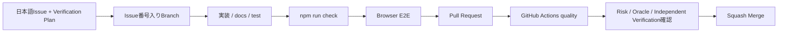

# コントリビューションガイド

このテンプレートへの改善提案・バグ修正・共通基盤の改善を歓迎します。

## 必須ルール

1. **mainへの直接Commit / Pushは禁止します。**
2. **mainへ取り込む変更単位ごとに日本語Issueを作成します。**
3. Issueに対応するIssue番号入り作業ブランチを作成します。
4. 作業ブランチで変更・テスト・Commit / Pushします。
5. **必ずPull Requestを作成します。**
6. PR本文からIssueを関連付けます。
7. `npm run check`、Browser E2E、CI、差分を確認してからmainへ取り込みます。
8. **原則Squash Merge**とします。
9. README / docsへの影響は同じPRで最新化します。
10. **CIがGreenであることだけを品質保証とせず、Issue / PRのVerification PlanでRiskと正しい状態を先に定義します。**



## Issue

原則 **1 Issue = 1 PR** です。本文では最低限、目的・対応内容・影響範囲・完了条件を明確にします。

振る舞いや品質契約を変更する場合は、実装前に次を記載します。

- Risk Level: Low / Medium / High
- Important Risk: 何が壊れたら困るか
- Correct State / Test Oracle: 何を正しい結果とするか
- Verification Layer: どこで検証するか
- Blocking Signal: 何が失敗したらMergeを止めるか
- Falsification / Negative Case: 実装が誤っていたら失敗するケース
- Independent Verification: 実装Loopと異なる評価軸

詳細は [docs/QUALITY-VERIFICATION.md](docs/QUALITY-VERIFICATION.md) を参照してください。

Security issueを報告する場合は、攻撃手順・token・秘密情報・実データをPublic Issueへ記載せず、[.github/SECURITY.md](.github/SECURITY.md) の報告手順を使用してください。

## ブランチ命名

```text
feat/12-inventory-search
fix/18-auth-redirect
docs/23-update-readme
refactor/31-supabase-client
test/42-add-rls-contract
chore/70-update-dependencies
```

## Pull Request

`.github/pull_request_template.md` を利用し、以下を確認します。

- 対応Issue
- 変更内容
- Verification Plan
- Greenが保証する範囲 / Greenだけでは保証しない範囲
- テスト
- 影響範囲
- Supabase Schema / RLS影響
- Auth / Session / Cookie影響
- Production env変更
- PWA / Service Worker影響
- dependency変更
- Vercel / deploy影響
- README / docs更新

通常は:

```text
Closes #123
```

を利用します。Merge後の実Supabase / Vercel確認が完了条件として残る場合は、Issueを受入確認までOpenに保つ運用も可能です。

## Verification Design

AI / Coding AgentへProduction CodeとTest Codeの両方を任せても構いません。ただし、Agent自身の「テストが通ったので問題ありません」だけを最終Quality Gateにはしません。

変更ごとに次を確認します。

1. IssueでRiskとCorrect Stateを実装前に定義したか
2. テストがそのRiskを本当に観測しているか
3. Production CodeとTest Codeの辻褄を合わせるためにOracleを弱めていないか
4. 正常系だけでなく境界値・異常系を検討したか
5. High Risk変更にIndependent VerificationまたはHuman Judgmentがあるか

High Riskの例:

- Auth / Session / Cookie
- RLS / GRANT / Database Schema
- Production env
- Service Workerの認証関連Cache
- E2E fixtureのProduction隔離
- dependency major update
- CI / Ruleset / deploy条件

## ローカル品質チェック

```powershell
npm run doctor
npm ci
npm run check
```

`npm run check` は次を実行します。

- ESLint
- TypeScript typecheck
- Node test
- Next.js production build

User操作を変更した場合は、必要に応じてChromium E2Eも実行します。

```powershell
npm run test:e2e:install
npm run test:e2e
```

## CI / Supply Chain

GitHub Actionsは次を検証します。

- GitHub設定スクリプト
- Node.js 22
- Doctor
- `npm ci`
- lint / typecheck / test / build
- Playwright Chromium Browser keyboard E2E
- Todoサンプル削除後のsampleless template smoke test
- Repository内Markdownリンク整合性

外部GitHub Actionはfloating tagではなくfull commit SHAへ固定します。DependabotのGitHub Actions更新も通常PRとしてCIを通してから取り込みます。

Protect main RulesetはRequired Status ChecksをStrictにし、mainが更新された場合は最新mainとの組み合わせを再確認してからMergeします。

CI失敗中はMergeしません。一方、CIがすべてGreenでも、Verification Planで定義したRiskを観測していない場合はMerge判断の根拠として不十分です。

## Supabase / Auth変更

次はHigh Riskとして扱います。

- Schema / RLS / GRANT
- Auth Confirm / Redirect
- Session / Cookie
- Browser / Server Client
- Publishable Key / env contract

可能な範囲でContract TestとBrowser E2Eを使い、実Supabase固有の挙動は受入確認として分離します。RLSをアプリ側条件だけで代用しません。

## PWA / Service Worker変更

認証済みResponseやAPI ResponseをCacheしない契約を維持します。`/auth`、`/dashboard`、`/api` 等の扱いを変える場合は、既存契約テストと実ブラウザ挙動を確認します。

## 依存関係変更

- `package.json` と `package-lock.json` を同じPRで更新
- core dependencyは再現可能なVersion契約を維持
- Dependabot PRも通常CIを通して判断
- major updateはRelease Note / compatibilityを確認
- Playwright更新ではBrowser E2Eを必ず実行

ESLint 10はNext.js側の正式対応を確認してから移行します。

## Merge前チェック

- 日本語Issueがある
- ブランチ名にIssue番号がある
- mainへの直接変更ではない
- Verification Planが変更内容に対応している
- `npm run check` が成功
- GitHub Actions `quality` が成功
- Browser E2Eが成功
- sampleless smoke testが成功
- `.env.local` / Secret Key / service_role / DB password等が含まれていない
- 必要なテストがある
- 振る舞い変更では境界値・異常系を検討した
- Auth / RLSを弱めていない
- ProductionでE2E fixtureが有効にならない
- High Risk変更でAIの自己確認だけに依存していない
- README / docsが最新
- Squash Mergeを選択している

## CI成功報告

完了報告では最低限次を併記します。

- 修正ソース一覧
- 修正ドキュメント一覧
- 修正または追加したテスト一覧
- CI結果
- 重要なRiskと、それを確認したVerification Signal
- Greenだけでは未保証の範囲が残る場合はその内容

## Gitへ登録してはいけないもの

```text
.env.local
.env.*.local
Supabase Secret Key
service_role key
DB password
Vercel token
その他の秘密情報
```

## テンプレート本体へ追加するもの

複数のNext.js / Supabaseアプリで再利用価値がある共通基盤・安全策・品質改善を基本とします。特定会社・特定業務だけで必要な機能は、このテンプレートから作成した各アプリ側で実装します。

## 関連ドキュメント

- [GETTING-STARTED.md](GETTING-STARTED.md)
- [docs/CUSTOMIZING.md](docs/CUSTOMIZING.md)
- [docs/EXTENDING.md](docs/EXTENDING.md)
- [docs/DEVELOPMENT.md](docs/DEVELOPMENT.md)
- [docs/QUALITY-VERIFICATION.md](docs/QUALITY-VERIFICATION.md)
- [docs/GITHUB-SETUP.md](docs/GITHUB-SETUP.md)
- [docs/SUPABASE-SETUP.md](docs/SUPABASE-SETUP.md)
- [docs/SECURITY.md](docs/SECURITY.md) - 実装時のSecurity設計
- [.github/SECURITY.md](.github/SECURITY.md) - 脆弱性報告ポリシー
- [docs/DEPLOYMENT.md](docs/DEPLOYMENT.md)
- [docs/OPERATIONS.md](docs/OPERATIONS.md)
