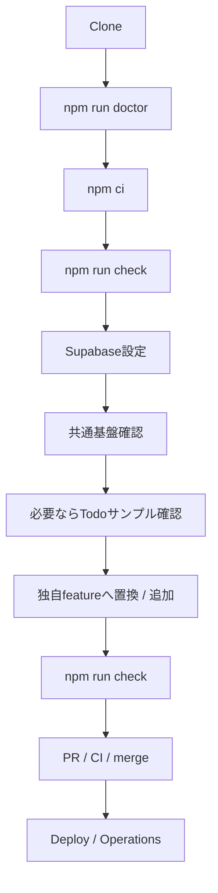
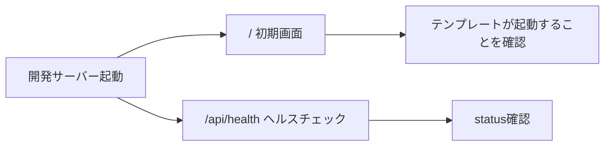
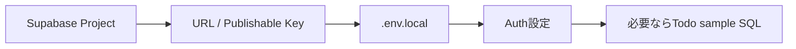
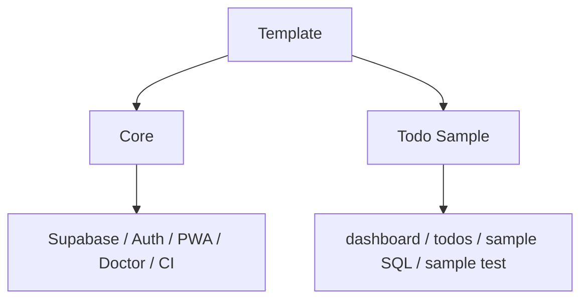
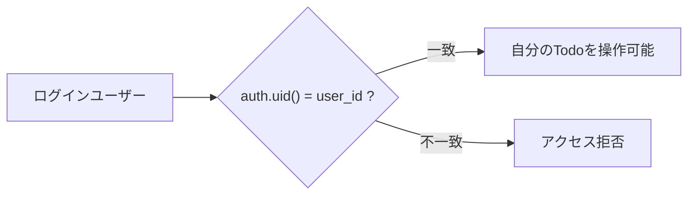
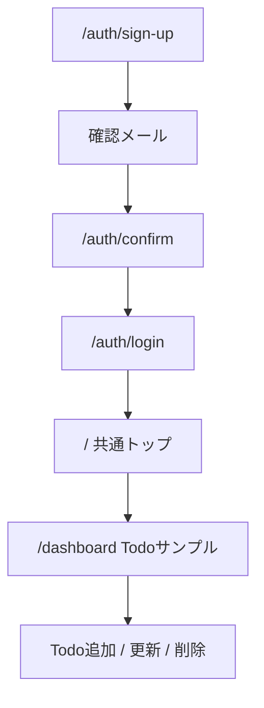
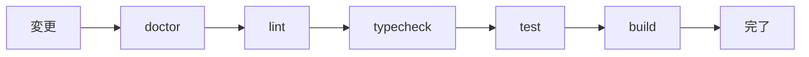
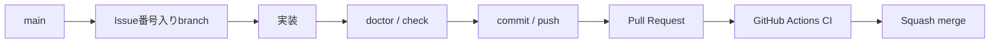

# Getting Started

このドキュメントは、このテンプレートをCloneして動作確認し、そこから自分のWebアプリ開発を始めるための手順です。

**Git / GitHub / GitHub Desktopの用語や、Branch → Commit → Push → Pull Request → CI → Mergeの流れがまだ分からない場合は、先に [BEGINNER-GUIDE.md](BEGINNER-GUIDE.md) を読んでください。**

Todo CRUDは仕組みを確認するための**削除可能なサンプル**です。共通基盤とは分離しているため、独自アプリではサンプル一式だけを削除・置換できます。詳しくは [docs/CUSTOMIZING.md](docs/CUSTOMIZING.md) を参照してください。

## 全体フロー



## 1. 前提

- GitHubアカウント
- GitHub Desktop
- Node.js 22以上27未満
- npm
- Supabaseアカウント
- Vercelアカウント（本番デプロイ時）

```powershell
node --version
npm --version
```

## 2. Clone

GitHub Desktop: `File` → `Clone repository...`

または:

```bash
git clone https://github.com/k-systems202208/nextjs-supabase-vercel-webapp-template.git
cd nextjs-supabase-vercel-webapp-template
```

自分の新規アプリとして利用する場合は、GitHub上で **Use this template** から新しいリポジトリを作成し、そのリポジトリをCloneする方法を推奨します。テンプレート本体へ案件固有コードを追加しません。

## 3. 最初にDoctorを実行

依存パッケージを入れる前でも実行できます。

```powershell
npm run doctor
```

主に次を確認します。

- Node.jsが対象Versionか
- `package.json` / `package-lock.json` / `.env.example` が揃っているか
- `.env.local` がある場合、主要Supabase環境変数がサンプル値のままではないか

`.env.local` 未作成は警告です。Node.js対象外や必須Repositoryファイル欠落はFAILです。

## 4. 依存関係

`package-lock.json` がコミット済みなので通常は以下を使います。

```powershell
npm ci
```

依存バージョンを意図的に変更する場合だけ `npm install` を使い、更新されたlockfileもコミットします。

## 5. まずテンプレート単体を確認

Supabaseを設定しなくても、トップページとヘルスチェック、品質チェックは確認できます。

```powershell
npm run check
npm run dev
```



- `/` 初期画面
- `/api/health` ヘルスチェック

この時点で `npm run doctor` が致命的エラーなし、`npm run check` が成功することをカスタマイズ前の基準状態とします。

## 6. Supabaseを設定する

認証・サンプルCRUDを利用する場合はSupabaseを設定します。

**初めてSupabaseを設定する場合は、[docs/SUPABASE-SETUP.md](docs/SUPABASE-SETUP.md) を上から順に実施してください。**

詳細手順には次を含みます。

1. Supabaseアカウント / Organizationの準備
2. 新規Project作成
3. Project URL / Publishable Key取得
4. `.env.local` 作成
5. `/api/health` でアプリ設定状態を確認
6. Todoサンプルを試す場合だけ `supabase/sample/todos.sql` 実行
7. Email / Password認証確認
8. Site URL / Redirect URL設定
9. 確認メール
10. Sign up → Login → Todo CRUD確認
11. Custom SMTPの注意点
12. Vercel環境変数 / Production URL設定
13. よくあるエラーの確認方法



最小限のローカル環境変数は次です。

```powershell
Copy-Item .env.example .env.local
npm run doctor
```

```env
NEXT_PUBLIC_SUPABASE_URL=https://your-project.supabase.co
NEXT_PUBLIC_SUPABASE_PUBLISHABLE_KEY=sb_publishable_your-key
# NEXT_PUBLIC_SITE_URL=https://your-app.vercel.app
```

Project URL / Publishable KeyはSupabase Projectの **Connect** から取得します。

Secret Key / `service_role` / Database passwordは `NEXT_PUBLIC_` へ設定しません。

## 7. 共通基盤とTodoサンプルの境界

このテンプレートでは、Todoサンプルを次の4か所へ分離しています。

```text
app/(sample)/dashboard/       Todoサンプル画面（URLは /dashboard）
features/todos/               Todo用Server Action
supabase/sample/todos.sql     Todoテーブル / GRANT / RLS
tests/sample.test.mjs         Todoサンプル専用テスト
```

一方、次は共通基盤として原則残します。

- `lib/supabase/` のBrowser / Server Client
- `proxy.ts` とAuthセッション更新
- `app/auth/` の認証実装例
- `/api/health`
- PWA基本構成
- `scripts/doctor.mjs`
- `tests/core.test.mjs`
- `tests/doctor.test.mjs`
- `tests/template-lifecycle.test.mjs`
- lint / typecheck / build / CI



Todoを使わない場合は、サンプル4か所をまとめて削除して構いません。共通テストはTodoサンプルの存在を必須にしていません。

## 8. TodoサンプルDatabase / RLS

Todoサンプルを動かして仕組みを確認したい場合だけ、Supabase Dashboard → SQL Editor で次を実行します。

```text
supabase/sample/todos.sql
```

作成される `todos` は authenticatedユーザーにのみCRUD権限を付与し、RLSで本人の行だけを操作可能にします。



独自アプリでは、このSQLをそのまま業務DBとして使うのではなく、自分のテーブル設計・RLS Policyへ置き換えてください。

詳細は [docs/SUPABASE-SETUP.md](docs/SUPABASE-SETUP.md) と [docs/AUTH-CRUD.md](docs/AUTH-CRUD.md) を参照してください。

## 9. Auth URL設定

Supabase Dashboard → Authentication → URL Configuration でローカル開発用URLを登録します。

```text
Site URL: http://localhost:3000
Redirect URL: http://localhost:3000/**
```

本番時はVercel Production URLも設定します。Vercel PreviewでAuthを確認する場合はPreview URLも許可します。

確認メール・Vercel本番設定を含む詳細は [docs/SUPABASE-SETUP.md](docs/SUPABASE-SETUP.md) を参照してください。

## 10. サンプル機能の確認

Todoサンプルを残している場合は、次の流れを確認できます。共通AuthはTodoへ固定遷移せず、Login / Confirm後はいったん `/` へ戻ります。



```powershell
npm run dev
```

- `/auth/sign-up` アカウント作成
- `/auth/login` ログイン（成功後は `/`）
- `/dashboard` Todo CRUD（トップページから任意に開くサンプル）
- `/offline` PWAオフライン画面

Supabase設定後は、別ユーザーを2人作成し、一方のTodoが他方から見えないことまで確認するとRLSの動作確認になります。

## 11. 自分のアプリへ作り替える / 拡張する

まず [docs/CUSTOMIZING.md](docs/CUSTOMIZING.md) に沿ってサンプルを整理し、新しいfeatureの設計契約は [docs/EXTENDING.md](docs/EXTENDING.md) を参照します。

Todoを使わない場合は次を削除します。

```text
app/(sample)/dashboard/
features/todos/
supabase/sample/todos.sql
tests/sample.test.mjs
```

その後、自分の画面、業務処理、テーブル / RLS、テストを追加します。AuthやPWAも不要であれば個別に外せますが、Todoサンプルとは別の共通機能として扱います。

## 12. 品質チェック

変更の区切りごとに実行します。

```powershell
npm run doctor
npm run check
```



Todoサンプルを削除した場合でも、`tests/sample.test.mjs` を一緒に削除していれば共通基盤テストだけで `npm run check` を継続できます。

## 13. PWA確認

Service WorkerはProductionでのみ登録します。

```powershell
npm run build
npm start
```

ブラウザのApplication / Manifest / Service Workersで確認します。Auth / Dashboard / APIはオフラインキャッシュ対象外です。

## 14. ChatGPT / Codex

ChatGPT / Codexでは、テンプレートから作成した対象アプリのリポジトリと、変更目的・変更範囲・完了条件を明示します。

例:

```text
このリポジトリは nextjs-supabase-vercel-webapp-template から作成しました。
Todoサンプルは削除して、○○管理アプリを実装してください。
共通基盤のSupabase SSR、RLS方針、PWA、Doctor、CIは維持してください。
新しい業務機能は共通coreへ混ぜずfeature単位で整理してください。
完了条件は npm run doctor と npm run check 成功です。
```

GitHub Appに対象リポジトリのアクセス権が付与されている場合は、ChatGPTからブランチ作成・Commit・PR・CI確認・mergeまで進められます。

Git自体の操作や用語が分からない場合は [BEGINNER-GUIDE.md](BEGINNER-GUIDE.md) の「自分で編集する場合とChatGPT / Codexへ依頼する場合」を参照してください。

## 15. Gitフロー



Git / GitHub未経験者向けの用語説明とGitHub Desktop操作は [BEGINNER-GUIDE.md](BEGINNER-GUIDE.md) にまとめています。

## 16. デプロイ後の運用

Vercel反映後の確認、障害切り分け、環境変数変更、Database変更時の注意、ロールバックは [docs/OPERATIONS.md](docs/OPERATIONS.md) を参照してください。

## 17. CI成功報告ルール

CI成功報告時は必ず次を併記します。

- 修正ソース一覧
- 修正ドキュメント一覧
- 修正または追加したテスト一覧
- CI結果
