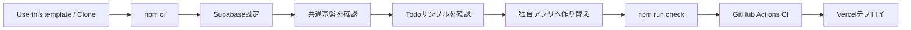
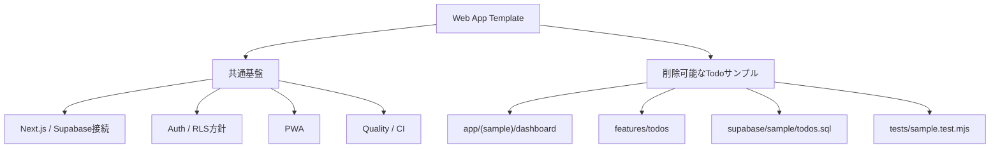
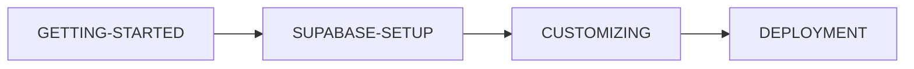
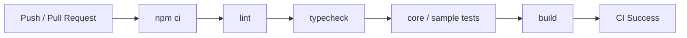

# Next.js + Supabase + Vercel Web App Template

Next.js App Router、Supabase、Vercel を使ったWebアプリ開発をすぐに始めるための**共通テンプレート**です。

認証、RLSを前提としたSupabase接続、PWA、品質チェック、CIまでを共通基盤として初期実装し、Todo CRUDは仕組みを確認するための**削除可能なサンプル**として分離しています。第三者がこのリポジトリから新しいアプリを作り、サンプルだけを削除・置換して利用することを前提にしています。

## このテンプレートの全体像



## このテンプレートの考え方

このリポジトリは完成済みTodoアプリではありません。

### 原則として残す共通基盤

- Next.js App Router の基本構成
- Supabase Browser / Server Client
- Authセッション更新の仕組み
- RLSを前提としたセキュリティ設計
- Login / Sign up / Confirm の認証実装例
- PWAの基本構成
- `/api/health`
- lint / typecheck / test / build
- GitHub Actions CI
- Dependabot
- Vercelデプロイ手順

### 削除・置換できるTodoサンプル

Todoサンプルは、共通基盤から分離して次の場所へまとめています。

```text
app/(sample)/dashboard/       Todoサンプル画面（URLは /dashboard）
features/todos/               Todo用Server Action
supabase/sample/todos.sql     Todoテーブル / GRANT / RLS
tests/sample.test.mjs         Todoサンプル専用テスト
```

Todoを使わない新規アプリでは、上記のサンプル一式を削除し、自分の画面・業務処理・Database/RLS・テストへ置き換えます。共通テスト `tests/core.test.mjs` はTodoサンプルの存在に依存しません。



具体的な作り替え手順は [docs/CUSTOMIZING.md](docs/CUSTOMIZING.md) を参照してください。

## 技術構成

- Next.js 16.3.3 / App Router
- React 19.2.8
- TypeScript 5.9.3
- Supabase (`@supabase/ssr` / `@supabase/supabase-js`)
- Vercel
- ESLint 9系
- GitHub Actions CI
- Node.js 22

## 含まれるもの

- Supabase Browser / Server Client
- `proxy.ts` によるCookie Authセッション更新
- メール/パスワード Login / Signup / Confirm / Signout
- 分離済みTodo CRUDサンプル
- `auth.uid() = user_id` のRLSサンプル
- Data API向け明示GRANTサンプル
- PWA Manifest / Service Worker / Offline fallback
- `/api/health`
- lint / typecheck / test / build
- GitHub Actions CI
- Dependabotによる依存関係の月次確認
- Vercelデプロイ手順
- GitHub Desktop / ChatGPT / Codex 開発手順

## クイックスタート

新しいアプリを作る場合はGitHubの **Use this template** から自分用リポジトリを作成し、そのリポジトリをCloneする方法を推奨します。

テンプレート自体を直接確認する場合:

```bash
git clone https://github.com/k-systems202208/nextjs-supabase-vercel-webapp-template.git
cd nextjs-supabase-vercel-webapp-template
npm ci
```

Windows PowerShell:

```powershell
Copy-Item .env.example .env.local
npm run check
npm run dev
```

`.env.local`:

```env
NEXT_PUBLIC_SUPABASE_URL=https://your-project.supabase.co
NEXT_PUBLIC_SUPABASE_PUBLISHABLE_KEY=sb_publishable_your-key
# NEXT_PUBLIC_SITE_URL=https://your-app.vercel.app
```

Supabase Projectの作成、Project URL / Publishable Keyの取得、Auth URL、確認メール、Database / RLS、Vercel本番設定までの詳細は [docs/SUPABASE-SETUP.md](docs/SUPABASE-SETUP.md) を参照してください。

Todo CRUDサンプルを試す場合だけ、`supabase/sample/todos.sql` をSupabase SQL Editorで実行します。

Supabase未設定でもトップページと `/api/health` は起動できます。認証・Todo CRUDはSupabase設定後に利用します。

## サンプルURL

- `/auth/login` ログイン
- `/auth/sign-up` サインアップ
- `/dashboard` Todo CRUD（削除可能なサンプル）
- `/offline` PWAオフライン画面
- `/api/health` ヘルスチェック

## 開発コマンド

| コマンド | 内容 |
| --- | --- |
| `npm run dev` | 開発サーバー起動 |
| `npm run lint` | ESLint |
| `npm run typecheck` | TypeScript型チェック |
| `npm test` | 共通基盤 + 現在含まれているサンプルのテスト |
| `npm run build` | 本番ビルド |
| `npm run check` | lint → typecheck → test → build |

Todoサンプルを削除する場合は `tests/sample.test.mjs` も同時に削除します。`tests/core.test.mjs` は残します。

## ドキュメント

初めて利用する場合は、次の順で読むと全体を追いやすくなります。



- [GETTING-STARTED.md](GETTING-STARTED.md) - Cloneから開発開始まで
- [docs/SUPABASE-SETUP.md](docs/SUPABASE-SETUP.md) - Supabase Project作成からAuth / Database / RLS / Vercel設定まで
- [docs/CUSTOMIZING.md](docs/CUSTOMIZING.md) - サンプルから独自アプリへ作り替える手順
- [docs/AUTH-CRUD.md](docs/AUTH-CRUD.md) - Auth / CRUD / RLS
- [docs/PWA.md](docs/PWA.md) - PWAとキャッシュ方針
- [docs/ARCHITECTURE.md](docs/ARCHITECTURE.md) - 構成と設計方針
- [docs/DEVELOPMENT.md](docs/DEVELOPMENT.md) - 日常の開発・Git・CI・依存関係更新
- [docs/DEPLOYMENT.md](docs/DEPLOYMENT.md) - Vercelデプロイ
- [docs/SECURITY.md](docs/SECURITY.md) - セキュリティ方針

## CI

`main` へのPushおよびPull Requestで `npm ci` → lint → typecheck → test → build を実行します。



共通基盤テストとサンプルテストを分離しているため、新規アプリでTodoサンプルを外すときはサンプルテストだけを一緒に外せます。

## 依存関係の保守

Dependabotで npm と GitHub Actions を月1回確認します。minor / patch はグループ化し、major update は個別に互換性を確認してから取り込みます。

ESLint 10は、Next.js 16系の `eslint-config-next` が正式対応するまで強制更新しません。現時点ではESLint 9系を固定し、上流対応後にCIで互換性を確認したうえで移行します。詳細は [docs/DEVELOPMENT.md](docs/DEVELOPMENT.md) を参照してください。

## セキュリティ

ブラウザで使用するのはPublishable Keyのみです。Secret Key / `service_role` / DB passwordを `NEXT_PUBLIC_` へ設定したりGitHubへコミットしたりしないでください。

認可はアプリ側チェックだけで完結させず、RLSを最終防御層として維持します。PWAもAuth / Dashboard / APIレスポンスをキャッシュしません。

## テンプレートとしての運用

このリポジトリ自体には案件固有仕様を積み上げません。Todoサンプルは実装例として維持し、特定業務向けの機能追加は、このテンプレートから作成した各アプリ側で行います。

## License

MIT Licenseです。第三者はLICENSEの条件に従って、利用・変更・再配布できます。詳細は [LICENSE](LICENSE) を参照してください。
