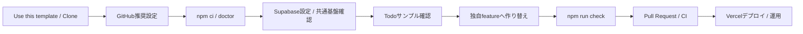
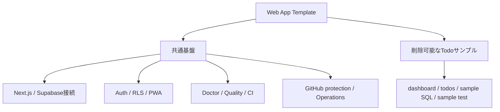
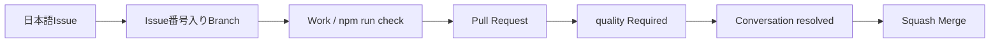
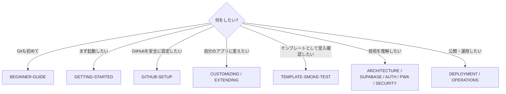

# Next.js + Supabase + Vercel Web App Template

Next.js App Router、Supabase、Vercel を使ったWebアプリ開発をすぐに始めるための**共通テンプレート**です。

認証、RLSを前提としたSupabase接続、PWA、品質チェック、CIまでを共通基盤として初期実装し、Todo CRUDは仕組みを確認するための**削除可能なサンプル**として分離しています。第三者がこのリポジトリから新しいアプリを作り、サンプルだけを削除・置換して利用することを前提にしています。

> **Git / GitHubをほとんど使ったことがない場合は、最初に [BEGINNER-GUIDE.md](BEGINNER-GUIDE.md) を読んでください。** GitHub Desktopを使ったClone、Branch、Commit、Push、Pull Request、CI、Squash Mergeまでを、READMEを1行変更する練習付きで説明しています。

## このテンプレートの全体像



## このテンプレートの考え方

このリポジトリは完成済みTodoアプリではありません。

### 原則として残す共通基盤

- Next.js App Router の基本構成
- Supabase Browser / Server Client
- Authセッション更新の仕組み
- RLSを前提としたセキュリティ設計
- Login / Sign up / Confirm の認証実装例
- PWAの基本構成
- `/api/health`
- `npm run doctor` による環境診断
- lint / typecheck / test / build
- GitHub Actions CI
- Todoサンプル削除後も成立するsampleless CI smoke test
- GitHub推奨設定スクリプト / Protect main Ruleset
- Dependabot
- Vercelデプロイ・運用Runbook
- feature拡張の共通契約

### 削除・置換できるTodoサンプル

Todoサンプルは、共通基盤から分離して次の場所へまとめています。

```text
app/(sample)/dashboard/       Todoサンプル画面（URLは /dashboard）
features/todos/               Todo用Server Action
supabase/sample/todos.sql     Todoテーブル / GRANT / RLS
tests/sample.test.mjs         Todoサンプル専用テスト
```

Todoを使わない新規アプリでは、上記のサンプル一式を削除し、自分の画面・業務処理・Database/RLS・テストへ置き換えます。共通テスト `tests/core.test.mjs` はTodoサンプルの存在に依存しません。



具体的な作り替え手順は [docs/CUSTOMIZING.md](docs/CUSTOMIZING.md) を参照してください。

## 技術構成

- Next.js 16.3.4 / App Router
- React 19.2.8
- TypeScript 5.9.3
- Supabase (`@supabase/ssr` / `@supabase/supabase-js`)
- Vercel
- ESLint 9系
- GitHub Actions CI
- Node.js 22

## クイックスタート

Git / GitHubの操作に不安がある場合は、先に [BEGINNER-GUIDE.md](BEGINNER-GUIDE.md) の練習を1回行ってください。

新しいアプリを作る場合はGitHubの **Use this template** から自分用Repositoryを作成し、そのRepositoryをCloneします。

Clone後、GitHub CLIを利用できるWindows環境では次を実行すると、Pull Request必須・`quality` CI必須・Squash Merge onlyなどの推奨設定を適用できます。

```powershell
gh auth login
.\scripts\setup-github.ps1
```

詳細は [docs/GITHUB-SETUP.md](docs/GITHUB-SETUP.md) を参照してください。

開発環境:

```powershell
Copy-Item .env.example .env.local
npm run doctor
npm ci
npm run check
npm run dev
```

`.env.local`:

```env
NEXT_PUBLIC_SUPABASE_URL=https://your-project.supabase.co
NEXT_PUBLIC_SUPABASE_PUBLISHABLE_KEY=sb_publishable_your-key
# NEXT_PUBLIC_SITE_URL=https://your-app.vercel.app
```

Supabase Projectの作成、Project URL / Publishable Keyの取得、Auth URL、確認メール、Database / RLS、Vercel本番設定までの詳細は [docs/SUPABASE-SETUP.md](docs/SUPABASE-SETUP.md) を参照してください。

Todo CRUDサンプルを試す場合だけ `supabase/sample/todos.sql` をSupabase SQL Editorで実行します。Supabase未設定でもトップページと `/api/health` は起動できます。

## サンプルURL

- `/auth/login` ログイン
- `/auth/sign-up` サインアップ
- `/dashboard` Todo CRUD（削除可能なサンプル）
- `/offline` PWAオフライン画面
- `/api/health` ヘルスチェック

## 開発コマンド

| コマンド | 内容 |
| --- | --- |
| `npm run dev` | 開発サーバー起動 |
| `npm run doctor` | Node / lockfile / envの環境診断 |
| `npm run lint` | ESLint |
| `npm run typecheck` | TypeScript型チェック |
| `npm test` | 共通基盤 + 現在含まれているサンプルのテスト |
| `npm run build` | 本番ビルド |
| `npm run check` | lint → typecheck → test → build |

## GitHub運用

`github/protect-main.ruleset.json` と `scripts/setup-github.ps1` により、新しいRepositoryでも次の運用を再現できます。



- main削除禁止
- Force push禁止
- Linear history必須
- Pull Request必須
- Conversation resolution必須
- `quality` Required Status Check
- Squash Mergeのみ
- Merge後のhead branch自動削除

## ドキュメント - 目的から選ぶ

「上から全部読む」のではなく、今やりたいことに合わせて選んでください。



### 初めて使う

- [BEGINNER-GUIDE.md](BEGINNER-GUIDE.md) - Git / GitHub / GitHub Desktopをゼロから説明し、最初のPRを練習
- [GETTING-STARTED.md](GETTING-STARTED.md) - Clone後のセットアップ、初回起動、Supabase設定への導線
- [docs/GITHUB-SETUP.md](docs/GITHUB-SETUP.md) - Ruleset / Required Check / Merge設定を自動適用

### 自分のアプリへ変える・受入確認する

- [docs/CUSTOMIZING.md](docs/CUSTOMIZING.md) - Todoサンプルを削除・置換して独自アプリへ作り替える
- [docs/EXTENDING.md](docs/EXTENDING.md) - 独自feature追加時の共通契約
- [docs/TEMPLATE-SMOKE-TEST.md](docs/TEMPLATE-SMOKE-TEST.md) - Use this templateからsample削除・PRまでの第三者利用受入テスト

### 技術を理解する

- [docs/ARCHITECTURE.md](docs/ARCHITECTURE.md)
- [docs/SUPABASE-SETUP.md](docs/SUPABASE-SETUP.md)
- [docs/AUTH-CRUD.md](docs/AUTH-CRUD.md)
- [docs/PWA.md](docs/PWA.md)
- [docs/SECURITY.md](docs/SECURITY.md)

### 開発・公開・運用する

- [docs/DEVELOPMENT.md](docs/DEVELOPMENT.md)
- [docs/DEPLOYMENT.md](docs/DEPLOYMENT.md)
- [docs/OPERATIONS.md](docs/OPERATIONS.md)

## CI

`main` へのPushおよびPull Requestで、GitHub設定スクリプトのBOM / PowerShell構文を確認した後、`npm run doctor` → `npm ci` → `npm run check` を実行します。さらにCI workspace上でTodoサンプルを削除し、もう一度 `npm run check` を実行します。これにより**サンプルを外しても共通基盤が成立すること**を継続検証します。`quality` がmainのRequired Status Checkです。

## 依存関係の保守

Dependabotで npm と GitHub Actions を月1回確認します。minor / patch はグループ化し、major update は個別に互換性を確認してから取り込みます。

ESLint 10はNext.js 16系の `eslint-config-next` が正式対応するまで強制更新しません。詳細は [docs/DEVELOPMENT.md](docs/DEVELOPMENT.md) を参照してください。

## セキュリティ

ブラウザで使用するのはPublishable Keyのみです。Secret Key / `service_role` / DB passwordを `NEXT_PUBLIC_` へ設定したりGitHubへコミットしたりしないでください。認可はRLSを最終防御層として維持します。

## テンプレートとしての運用

このリポジトリ自体には案件固有仕様を積み上げません。Todoサンプルは実装例として維持し、特定業務向けの機能追加は、このテンプレートから作成した各アプリ側で行います。

## License

MIT Licenseです。第三者はLICENSEの条件に従って、利用・変更・再配布できます。詳細は [LICENSE](LICENSE) を参照してください。
