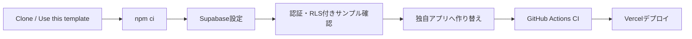
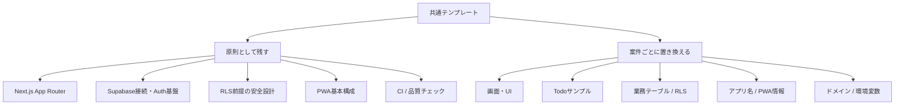
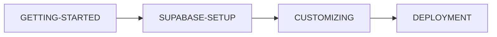
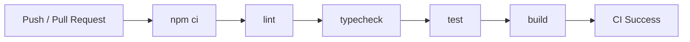

# Next.js + Supabase + Vercel Web App Template

Next.js App Router、Supabase、Vercel を使ったWebアプリ開発をすぐに始めるための**共通テンプレート**です。

認証、所有者RLS付きCRUD、PWA、CIまでを初期実装し、新規案件ごとの定型セットアップを減らします。第三者がこのリポジトリをCloneし、サンプル機能を削除・置換して、用途を問わず自分のWebアプリを作ることを前提にしています。

## このテンプレートの全体像



## このテンプレートの考え方

このリポジトリは完成済みTodoアプリではありません。

`todos` / `/dashboard` は、Supabase Auth・CRUD・RLSの実装方法を確認するための**削除可能なサンプル**です。新しいアプリを作る際は、必要に応じて自由に削除・置換してください。

テンプレートとして残すもの:

- Next.js App Router の基本構成
- Supabase Browser / Server Client
- Authセッション更新の仕組み
- RLSを前提としたセキュリティ設計
- PWAの基本構成
- lint / typecheck / test / build
- GitHub Actions CI
- Vercelデプロイ手順

案件ごとに置き換えるもの:

- アプリ名・説明
- トップページや画面UI
- `todos` サンプルCRUD
- `supabase/schema.sql` の業務テーブル
- RLS Policy
- PWA名・説明・アイコン
- ドメイン・環境変数

### 残すもの / 置き換えるもの



具体的な作り替え手順は [docs/CUSTOMIZING.md](docs/CUSTOMIZING.md) を参照してください。

## 技術構成

- Next.js 16.3.3 / App Router
- React 19.2.8
- TypeScript 5.9.3
- Supabase (`@supabase/ssr` / `@supabase/supabase-js`)
- Vercel
- ESLint
- GitHub Actions CI
- Node.js 22

## 含まれるもの

- Supabase Browser / Server Client
- `proxy.ts` によるCookie Authセッション更新
- メール/パスワード Login / Signup / Confirm / Signout
- `todos` サンプルCRUD
- `auth.uid() = user_id` のRLS Policy
- Data API向け明示GRANT
- PWA Manifest / Service Worker / Offline fallback
- `/api/health`
- lint / typecheck / test / build
- GitHub Actions CI
- Vercelデプロイ手順
- GitHub Desktop / ChatGPT / Codex 開発手順

## クイックスタート

```bash
git clone https://github.com/k-systems202208/nextjs-supabase-vercel-webapp-template.git
cd nextjs-supabase-vercel-webapp-template
npm ci
```

Windows PowerShell:

```powershell
Copy-Item .env.example .env.local
npm run dev
```

`.env.local`:

```env
NEXT_PUBLIC_SUPABASE_URL=https://your-project.supabase.co
NEXT_PUBLIC_SUPABASE_PUBLISHABLE_KEY=sb_publishable_your-key
# NEXT_PUBLIC_SITE_URL=https://your-app.vercel.app
```

Supabase Projectの作成、Project URL / Publishable Keyの取得、Database / RLS、Auth URL、確認メール、Vercel本番設定までの詳細は [docs/SUPABASE-SETUP.md](docs/SUPABASE-SETUP.md) を参照してください。

サンプルCRUDを動かす場合は `supabase/schema.sql` を Supabase SQL Editor で実行します。

Supabase未設定でもトップページと `/api/health` は起動できます。認証/CRUDはSupabase設定後に利用します。

## サンプルURL

- `/auth/login` ログイン
- `/auth/sign-up` サインアップ
- `/dashboard` Todo CRUD（要ログイン・サンプル機能）
- `/offline` PWAオフライン画面
- `/api/health` ヘルスチェック

## 開発コマンド

| コマンド | 内容 |
| --- | --- |
| `npm run dev` | 開発サーバー起動 |
| `npm run lint` | ESLint |
| `npm run typecheck` | TypeScript型チェック |
| `npm test` | スモークテスト |
| `npm run build` | 本番ビルド |
| `npm run check` | lint → typecheck → test → build |

## ドキュメント

初めて利用する場合は、次の順で読むと全体を追いやすくなります。



- [GETTING-STARTED.md](GETTING-STARTED.md) - Cloneから開発開始まで
- [docs/SUPABASE-SETUP.md](docs/SUPABASE-SETUP.md) - Supabase Project作成からAuth / Database / RLS / Vercel設定まで
- [docs/CUSTOMIZING.md](docs/CUSTOMIZING.md) - サンプルから独自アプリへ作り替える手順
- [docs/AUTH-CRUD.md](docs/AUTH-CRUD.md) - Auth / CRUD / RLS
- [docs/PWA.md](docs/PWA.md) - PWAとキャッシュ方針
- [docs/ARCHITECTURE.md](docs/ARCHITECTURE.md) - 構成と設計方針
- [docs/DEVELOPMENT.md](docs/DEVELOPMENT.md) - 日常の開発・Git・CI
- [docs/DEPLOYMENT.md](docs/DEPLOYMENT.md) - Vercelデプロイ
- [docs/SECURITY.md](docs/SECURITY.md) - セキュリティ方針

## CI

`main` へのPushおよびPull Requestで `npm ci` → lint → typecheck → test → build を実行します。



## セキュリティ

ブラウザで使用するのはPublishable Keyのみです。Secret Key / `service_role` / DB passwordを `NEXT_PUBLIC_` へ設定したりGitHubへコミットしたりしないでください。

認可はアプリ側チェックだけで完結させず、RLSを最終防御層として維持します。PWAもAuth / Dashboard / APIレスポンスをキャッシュしません。

## テンプレートとしての運用

このリポジトリ自体には案件固有仕様を積み上げません。サンプル機能は実装例として維持し、特定業務向けの機能追加は、このテンプレートから作成した各アプリ側で行います。
