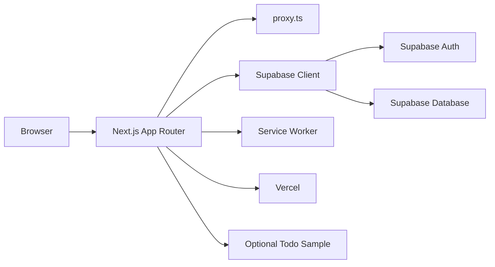
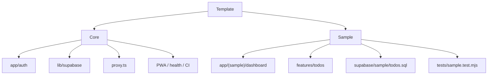
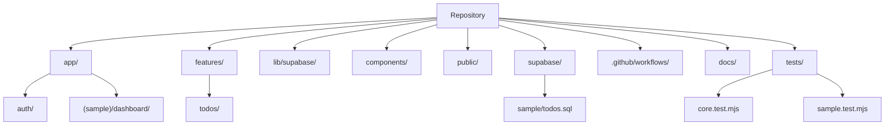
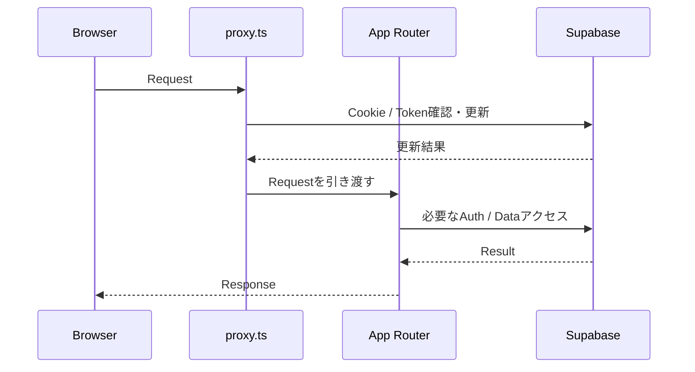
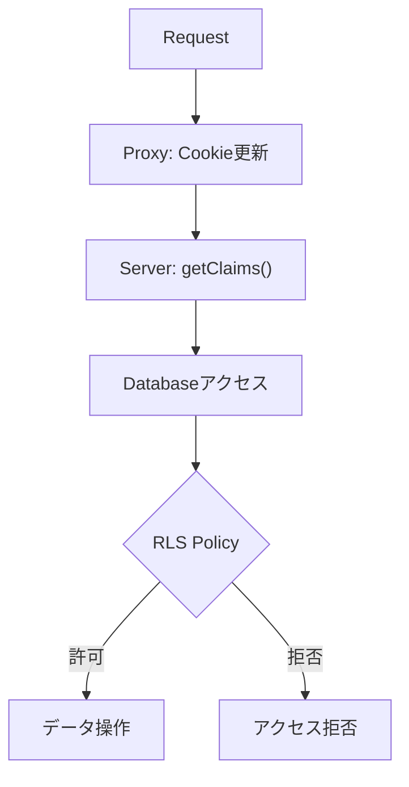

# Architecture

## 目的

このテンプレートは「再利用しやすい」「安全な初期値」「実案件の開始点として十分」に加え、**共通基盤と削除可能な業務サンプルを混ぜないこと**を優先します。

## システム全体像



## 共通基盤とサンプル



Todoサンプルを削除しても、Supabase接続・Auth・PWA・品質ゲートなどの共通基盤は独立して残せる構成にします。

## ディレクトリ

```text
app/
  api/health/route.ts          ヘルスチェック
  auth/                        Login / Signup / Confirm
  (sample)/dashboard/          削除可能なTodo CRUD画面（URLは /dashboard）
  offline/page.tsx             PWAオフライン画面
  manifest.ts                  Web App Manifest
  layout.tsx                   ルートレイアウト
  page.tsx                     初期画面
features/
  todos/actions.ts             削除可能なTodo業務処理
components/
  pwa-register.tsx             Service Worker登録
lib/supabase/
  client.ts                    Browser Client
  server.ts                    Server Client
  proxy.ts                     Auth Cookie更新
  env.ts                       環境変数検証
public/
  sw.js                        Service Worker
  icon-*.png                   PWAアイコン
supabase/
  sample/todos.sql             削除可能なTodo/RLSサンプルSQL
proxy.ts                       Next.js 16 Proxy entry
.github/workflows/ci.yml        CI
docs/                           運用ドキュメント
tests/
  core.test.mjs                共通基盤テスト
  sample.test.mjs              Todoサンプル専用テスト
```



## Server / Client の境界

- Browser Component: `lib/supabase/client.ts`
- Server Component / Server Action / Route Handler: `lib/supabase/server.ts`
- Cookieセッション更新: `proxy.ts` → `lib/supabase/proxy.ts`
- TodoサンプルのServer Action: `features/todos/actions.ts`



## 多層防御

1. Proxy: Auth Cookie更新
2. Server Component / Action: `getClaims()` で認証確認
3. Supabase RLS: データ所有・共有ルールで最終認可

Proxyを通っただけで認可済みとはみなしません。



## PWA

PWAは公開シェルと静的アセットだけをキャッシュし、Auth / Dashboard / APIはキャッシュ対象外にします。

## UI

テンプレートではUIライブラリを固定しません。Tailwind CSS、shadcn/ui等は案件要件に応じて追加します。
