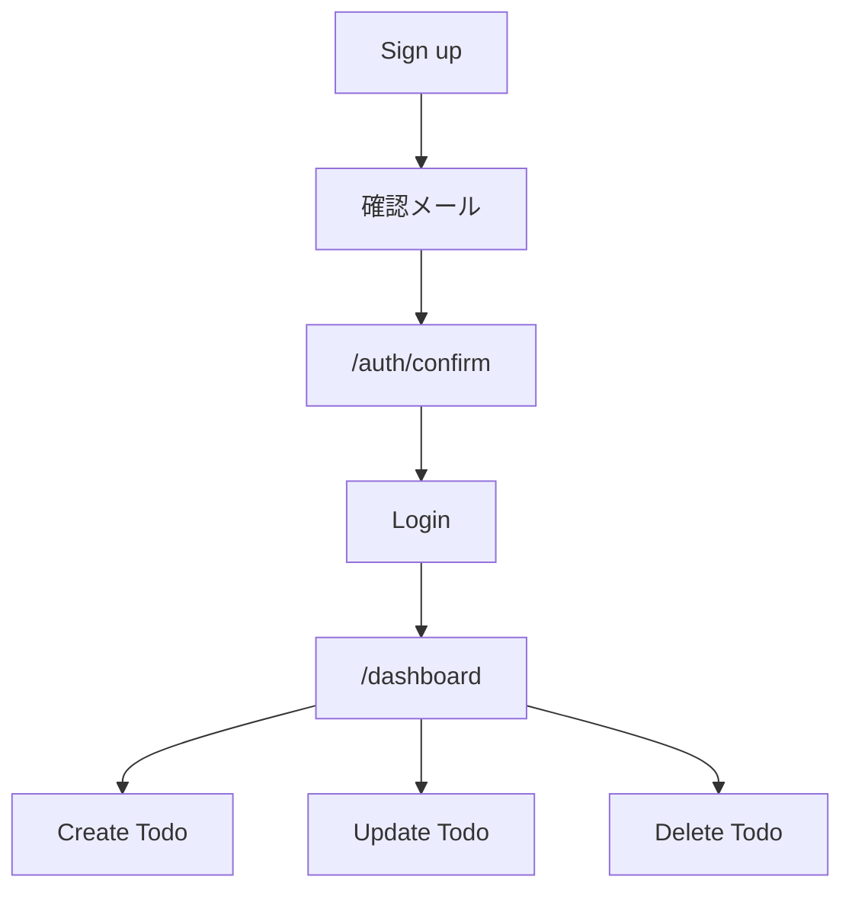
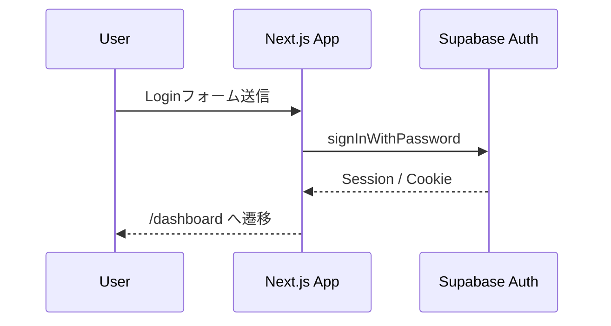
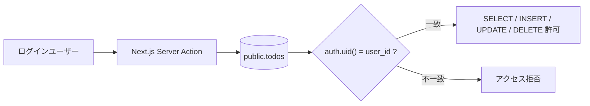
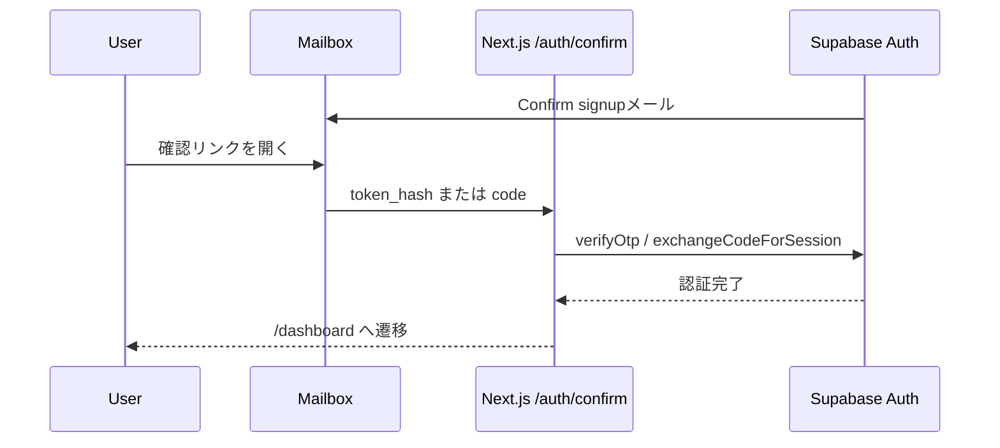

# Auth / CRUD / RLS

## 実装範囲

このテンプレートには、Supabase Auth のメール/パスワード認証と、ログインユーザー本人だけが操作できる Todo CRUD **サンプル**を含みます。

- `/auth/login` ログイン
- `/auth/sign-up` サインアップ
- `/auth/confirm` メール確認コールバック
- `/dashboard` 保護ページ + Todo CRUDサンプル
- `supabase/schema.sql` todosテーブル + RLSサンプル

`todos` はテンプレート利用者へCRUD/RLSの実装例を示すためのもので、アプリ固有の必須機能ではありません。独自アプリでは自由に削除・置換してください。置換手順は [CUSTOMIZING.md](CUSTOMIZING.md) を参照してください。

Supabase Projectをまだ作成していない場合や、Project URL / Publishable Key、SQL Editor、Auth URL、確認メール、Custom SMTP、Vercel環境変数まで順番に設定したい場合は、先に [SUPABASE-SETUP.md](SUPABASE-SETUP.md) を実施してください。

## Auth / CRUDの全体像



## 認証フロー



## Supabase Database

Todoサンプルを利用する場合は、Supabase SQL Editor で `supabase/schema.sql` を実行します。

このSQLは `authenticated` に必要なCRUD権限を明示的に付与し、`anon` のアクセスを取り除いたうえでRLSを有効化します。各Policyは `auth.uid() = user_id` で所有者を検証します。

独自アプリでは、実際のデータ所有関係・共有範囲・管理者権限に合わせてテーブルとPolicyを設計し直してください。

SupabaseのData APIでテーブルを利用する場合、RLS PolicyだけでなくPostgres RoleへのGRANTも必要です。このサンプルでは必要な権限を `schema.sql` へ明示しています。

### CRUDとRLSの関係



## Auth URL設定

Supabase Dashboard の Authentication → URL Configuration で、最低限以下を設定します。

ローカル:

```text
Site URL: http://localhost:3000
Redirect URL: http://localhost:3000/**
```

本番ではVercelのProduction URLをSite URL / Redirect URLへ追加します。Preview環境でも認証を確認する場合は、そのPreview URLも許可する必要があります。

詳細は [SUPABASE-SETUP.md](SUPABASE-SETUP.md) を参照してください。

## 確認メール

`/auth/confirm` は以下の両方を処理できます。

- `token_hash` + `type` を `verifyOtp` で検証する方式
- PKCEの `code` を `exchangeCodeForSession` で交換する方式



まずはSupabase標準の確認メールで動作確認できます。SSR向けに確認メールテンプレートをカスタマイズする場合は、Supabase公式ドキュメントのToken Hashを使う方式を利用できます。

本番で実ユーザーへAuthメールを送る場合、Supabase標準メール送信機能の制限を確認し、必要に応じてCustom SMTPを設定してください。

## セキュリティ

アプリ側の認証チェックだけを信用せず、DBのRLSを最終的な認可境界として維持します。Server Actionでも `getClaims()` を使ってログイン状態を検証し、RLSでも所有者を検証します。

ブラウザ用環境変数にはProject URLとPublishable Keyを使用し、Secret Key / `service_role` / Database passwordを `NEXT_PUBLIC_` へ設定しないでください。
