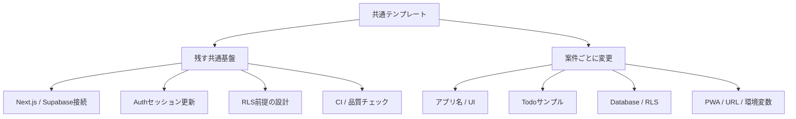
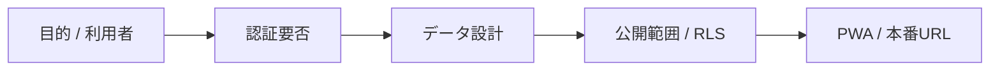
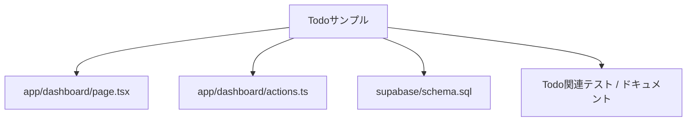
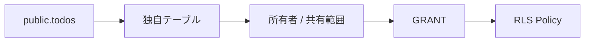
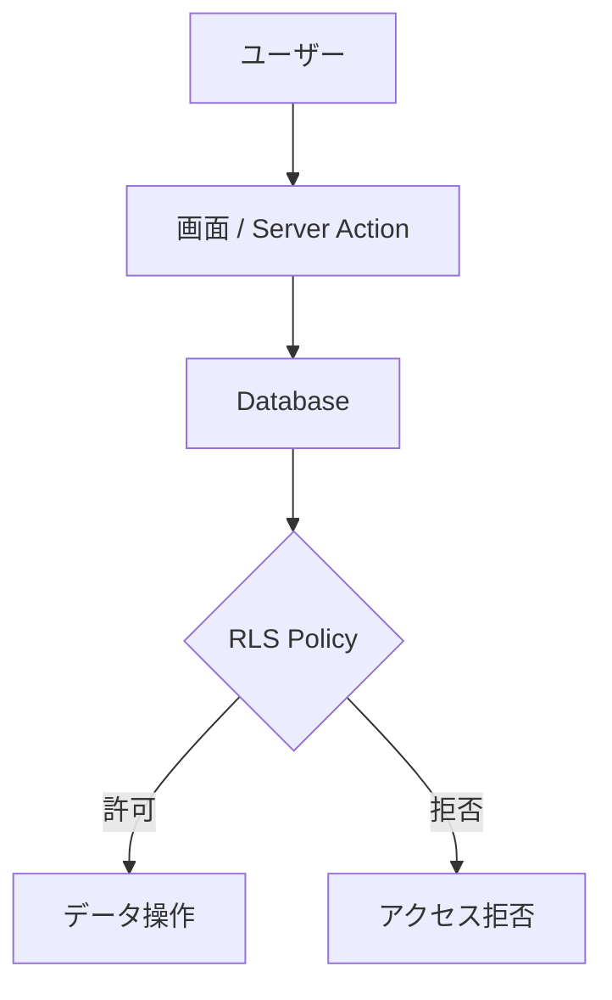
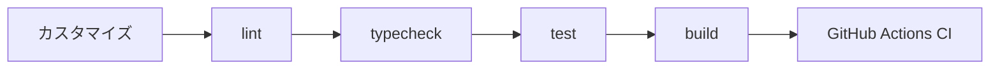

# 独自アプリへのカスタマイズ

このテンプレートは、特定業務向けの完成アプリではなく、Next.js App Router + Supabase + Vercel を使ったWebアプリ開発の共通土台です。

`todos` / `/dashboard` はAuth・CRUD・RLSを確認するためのサンプルです。新しいアプリでは自由に削除・置換してください。

## カスタマイズの全体像



## 1. 最初に決めること

Clone後、実装を始める前に最低限以下を決めます。

- アプリ名
- 目的
- 主な利用者
- 認証が必要か
- 保存するデータ
- 公開範囲
- PWAが必要か
- 本番URL



## 2. アプリ名・説明を変更する

最低限、以下を自分のアプリに合わせます。

- `package.json` の `name`
- `app/layout.tsx` のmetadata
- `app/manifest.ts` の `name` / `short_name` / `description`
- `README.md`
- `/api/health` のservice名

リポジトリ名も新しいアプリ名へ変更することを推奨します。

## 3. トップページ・UIを置き換える

`app/page.tsx` と `app/globals.css` はサンプル表示です。アプリ要件に合わせて自由に作り替えてください。

テンプレート側の見た目を維持する必要はありません。

## 4. Todoサンプルを使わない場合

Todoはサンプル機能です。不要なら以下を削除または置換できます。

```text
app/dashboard/page.tsx
app/dashboard/actions.ts
supabase/schema.sql 内の public.todos
```



Todoを削除した場合は、関連するテストとドキュメントも同時に更新してください。

認証後のトップページとして `/dashboard` を別用途に再利用しても構いません。

## 5. 独自テーブルへ置き換える

`supabase/schema.sql` の `todos` を参考に、アプリ固有のテーブルを設計します。

例:

```sql
create table public.items (
  id uuid primary key default gen_random_uuid(),
  user_id uuid not null references auth.users(id) on delete cascade,
  name text not null,
  created_at timestamptz not null default now()
);
```

ただし、サンプルSQLを機械的にコピーするのではなく、実際のデータ所有関係に合わせて設計してください。



## 6. RLSを設計する

公開schemaの業務テーブルでは、原則としてRLSを有効化します。

```sql
alter table public.items enable row level security;
```

ユーザー本人だけが扱うデータなら、サンプルと同様に `auth.uid()` と所有者列を比較します。

```sql
using (auth.uid() = user_id)
```

共有データ、管理者データ、組織単位データでは必要なPolicyが異なります。アプリ要件に合わせて設計してください。

アプリ側の画面制御だけを認可境界にせず、DBのRLSを最終防御層として維持します。



## 7. 認証を使わない場合

公開サイトなど認証不要のアプリではAuth関連を削除できます。

主な対象:

```text
app/auth/
proxy.ts のAuthセッション更新
lib/supabase/proxy.ts
```

ただし、Supabaseをブラウザから利用する場合のRLSと権限設計は、認証の有無にかかわらず必要です。

削除後は `npm run check` を実行し、不要になった依存・テスト・ドキュメントも整理してください。

## 8. PWAをカスタマイズする

以下を自分のアプリ用に変更します。

- `app/manifest.ts`
- `public/icon-192.png`
- `public/icon-512.png`
- `app/offline/page.tsx`

Service Workerのキャッシュ方針は、個人情報や認証後レスポンスを不用意に保存しないよう注意してください。

PWAが不要なら、Manifest・Service Worker・登録コンポーネントを削除することもできます。

## 9. 環境変数を設定する

`.env.example` は第三者が必要な設定項目を把握するためのテンプレートです。

新しい環境変数を追加したら、秘密値そのものではなく変数名とダミー値だけを `.env.example` に追記してください。

秘密情報はGitHubへコミットしません。

## 10. Vercelへ接続する

新しいアプリ用のGitHubリポジトリをVercelへImportし、Supabase関連の環境変数を設定します。

Supabase Authを使う場合は、Vercel Production URLをSupabase AuthenticationのSite URL / Redirect URLにも追加します。

詳細は [DEPLOYMENT.md](DEPLOYMENT.md) を参照してください。

## 11. テストをアプリ仕様へ置き換える

`tests/scaffold.test.mjs` はテンプレート自体の基本構成を守るためのスモークテストです。

独自アプリでは、サンプルTodoを削除したらTodo固有テストも削除し、代わりにそのアプリの重要仕様をテストしてください。

少なくとも以下は維持することを推奨します。

- 依存関係の固定確認
- lint
- TypeScript型チェック
- 秘密情報の混入防止
- 主要ルート/主要機能のテスト
- production build

## 12. カスタマイズ後の完了条件

以下を満たした状態を、新しいアプリの開発開始点とします。

```powershell
npm run check
```



さらに確認します。

- アプリ名・説明がテンプレートのまま残っていない
- 不要なTodoサンプルが残っていない
- 独自テーブルのRLSが設計されている
- `.env.example` が最新
- PWA名・アイコンが独自アプリ用になっている
- READMEが独自アプリの内容になっている
- GitHub Actions CIが成功している

## 13. このテンプレート本体へ追加しないもの

このテンプレート本体では、特定アプリだけに必要な業務機能を増やしません。

たとえば以下は、テンプレートから作成した各アプリ側で実装します。

- Todoの期限・タグ・通知などの機能拡張
- 特定会社向けマスタ
- 特定業務の画面
- 固有の外部API連携
- 固有の権限ロール

テンプレート本体へ追加するのは、複数のWebアプリで再利用価値がある共通基盤・安全策・開発手順を基本とします。
