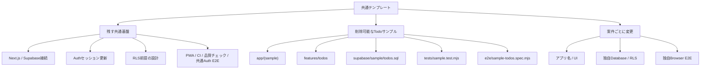
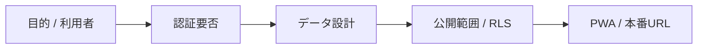
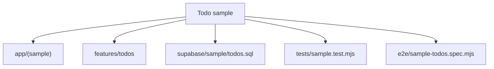
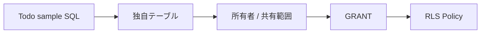
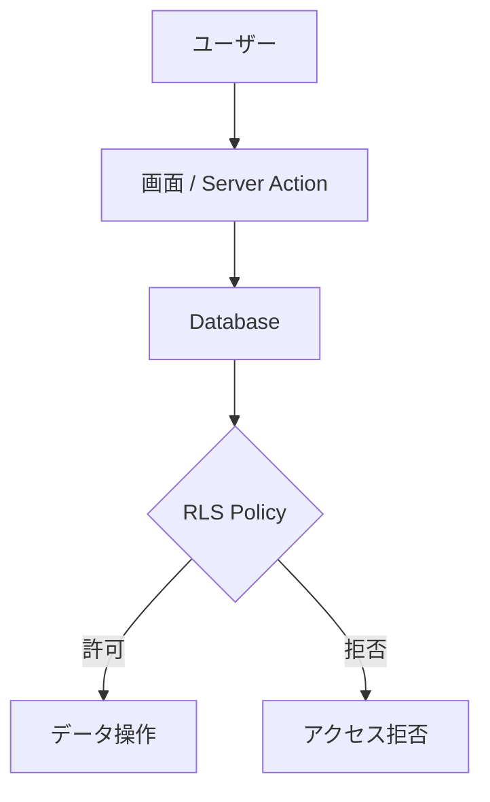
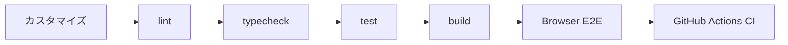

# 独自アプリへのカスタマイズ

このテンプレートは、特定業務向けの完成アプリではなく、Next.js App Router + Supabase + Vercel を使ったWebアプリ開発の共通土台です。

Todo CRUDは、Auth・CRUD・RLSの仕組みを確認するための**削除可能なサンプル**です。共通基盤とは分離しているため、新しいアプリではTodoサンプル一式だけを削除・置換できます。

## カスタマイズの全体像



## 1. 最初に決めること

Clone後、実装を始める前に最低限以下を決めます。

- アプリ名
- 目的
- 主な利用者
- 認証が必要か
- 保存するデータ
- データの所有者 / 共有範囲
- 公開範囲
- PWAが必要か
- 本番URL



## 2. 共通基盤とサンプルの境界

Todoサンプルは次の5グループに分離しています。

```text
app/(sample)/                Todo画面 + Todo専用E2E fixture API
features/todos/              Todo用Server Action + E2E fixture store
supabase/sample/todos.sql    Todoテーブル / GRANT / RLS
tests/sample.test.mjs        Todoサンプル専用契約テスト
e2e/sample-todos.spec.mjs    Todoサンプル専用ブラウザE2E
```

Todoを使わないアプリでは、上記5グループをまとめて削除してください。

**削除しても残す共通基盤:** 

- `app/auth/`
- `lib/supabase/`
- `lib/e2e/mode.ts`
- `e2e/auth.spec.mjs`
- `playwright.config.mjs`
- `proxy.ts`
- `app/api/health/`
- `app/manifest.ts` / `public/sw.js` 等のPWA基本構成
- `tests/core.test.mjs`
- `tests/browser-e2e.test.mjs`
- lint / typecheck / build / GitHub Actions CI

共通側はTodoサンプルのファイルやSQLを必須にしていません。そのためTodoサンプルを削除した後も `npm run check` が成立します。

## 3. アプリ名・説明を変更する

最低限、以下を自分のアプリに合わせます。

- `package.json` の `name`
- `app/layout.tsx` のmetadata
- `app/manifest.ts` の `name` / `short_name` / `description`
- `README.md`
- `/api/health` のservice名

リポジトリ名も新しいアプリ名へ変更することを推奨します。

## 4. トップページ・UIを置き換える

`app/page.tsx` と `app/globals.css` はテンプレートの案内画面です。アプリ要件に合わせて自由に作り替えてください。

テンプレート側の見た目を維持する必要はありません。

## 5. Todoサンプルを使わない場合

Todoサンプルを削除するときは、次を**セットで**扱います。

```text
app/(sample)/
features/todos/
supabase/sample/todos.sql
tests/sample.test.mjs
e2e/sample-todos.spec.mjs
```



削除した後に `npm run check` を実行し、共通基盤が正常なことを確認します。

`/dashboard` を別用途に再利用する場合は、新しい `app/dashboard/` または任意のRoute Group内へ独自画面を作成して構いません。

## 6. 独自テーブルへ置き換える

Todoサンプルを参考にする場合は `supabase/sample/todos.sql` を読み、アプリ固有のテーブルとRLSを設計します。

例:

```sql
create table public.items (
  id uuid primary key default gen_random_uuid(),
  user_id uuid not null references auth.users(id) on delete cascade,
  name text not null,
  created_at timestamptz not null default now()
);
```

ただし、サンプルSQLを機械的にコピーするのではなく、実際のデータ所有関係に合わせて設計してください。



独自アプリでDB変更を継続管理する段階では、Supabase CLI migrationへの移行を推奨します。詳細は [DEVELOPMENT.md](DEVELOPMENT.md) を参照してください。

## 7. RLSを設計する

公開schemaの業務テーブルでは、原則としてRLSを有効化します。

```sql
alter table public.items enable row level security;
```

ユーザー本人だけが扱うデータなら、サンプルと同様に `auth.uid()` と所有者列を比較します。

```sql
using (auth.uid() = user_id)
```

共有データ、管理者データ、組織単位データでは必要なPolicyが異なります。アプリ要件に合わせて設計してください。

アプリ側の画面制御だけを認可境界にせず、DBのRLSを最終防御層として維持します。



## 8. 認証を使わない場合

公開サイトなど認証不要のアプリではAuth関連を削除できます。ただしこれはTodoサンプル削除とは別のカスタマイズです。

主な対象:

```text
app/auth/
proxy.ts のAuthセッション更新
lib/supabase/proxy.ts
e2e/auth.spec.mjs
```

認証を外す場合はAuth関連のテスト・ドキュメント・リダイレクトも合わせて見直してください。

Supabaseをブラウザから利用する場合のRLSと権限設計は、認証の有無にかかわらず必要です。

## 9. PWAをカスタマイズする

以下を自分のアプリ用に変更します。

- `app/manifest.ts`
- `public/icon-192.png`
- `public/icon-512.png`
- `app/offline/page.tsx`

Service Workerのキャッシュ方針は、個人情報や認証後レスポンスを不用意に保存しないよう注意してください。

PWAが不要なら、Manifest・Service Worker・登録コンポーネントを削除できます。PWAもTodoサンプルとは別の共通機能です。

## 10. 環境変数を設定する

`.env.example` は第三者が必要な設定項目を把握するためのテンプレートです。

新しい環境変数を追加したら、秘密値そのものではなく変数名とダミー値だけを `.env.example` に追記してください。

秘密情報はGitHubへコミットしません。

## 11. Vercelへ接続する

新しいアプリ用のGitHubリポジトリをVercelへImportし、Supabase関連の環境変数を設定します。

Supabase Authを使う場合は、Vercel Production URLをSupabase AuthenticationのSite URL / Redirect URLにも追加します。

詳細は [DEPLOYMENT.md](DEPLOYMENT.md) を参照してください。

## 12. テストをアプリ仕様へ置き換える

テストは役割を分離しています。

```text
tests/core.test.mjs         共通基盤の保護
tests/browser-e2e.test.mjs  共通E2E契約の保護
tests/sample.test.mjs       Todoサンプルの保護
e2e/auth.spec.mjs           共通Auth実打鍵E2E
e2e/sample-todos.spec.mjs   Todoサンプル実打鍵E2E
```

Todoを削除したら `tests/sample.test.mjs` と `e2e/sample-todos.spec.mjs` も削除し、代わりにそのアプリの重要仕様と主要画面操作をテストしてください。

独自feature用E2Eでは、表示確認だけでなく、実際に入力欄へ文字を打ち、追加・更新・削除など利用者の主要操作を行うことを推奨します。

```powershell
npm run test:e2e:install
npm run test:e2e
```

`tests/core.test.mjs`、`tests/browser-e2e.test.mjs`、共通Authを使う場合の `e2e/auth.spec.mjs` は原則残します。

少なくとも以下は維持することを推奨します。

- 依存関係の固定確認
- lint
- TypeScript型チェック
- 秘密情報の混入防止
- 主要ルート / 主要機能の契約テスト
- 主要画面のブラウザ打鍵・クリックE2E
- production build

## 13. カスタマイズ後の完了条件

以下を満たした状態を、新しいアプリの開発開始点とします。

```powershell
npm run check
npm run test:e2e
```



さらに確認します。

- アプリ名・説明がテンプレートのまま残っていない
- 不要なTodoサンプル5グループが残っていない
- 独自feature用のブラウザE2Eへ置き換えた
- 独自テーブルのRLSが設計されている
- `.env.example` が最新
- PWA名・アイコンが独自アプリ用になっている
- READMEが独自アプリの内容になっている
- GitHub Actions CIが成功している

## 14. このテンプレート本体へ追加しないもの

このテンプレート本体では、特定アプリだけに必要な業務機能を増やしません。

たとえば以下は、テンプレートから作成した各アプリ側で実装します。

- Todoの期限・タグ・通知などの機能拡張
- 特定会社向けマスタ
- 特定業務の画面
- 固有の外部API連携
- 固有の権限ロール

テンプレート本体へ追加するのは、複数のWebアプリで再利用価値がある共通基盤・安全策・開発手順を基本とします。
