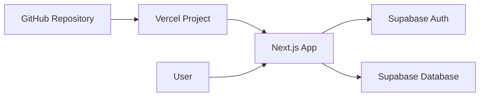
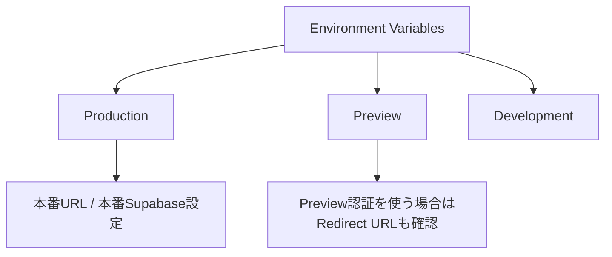
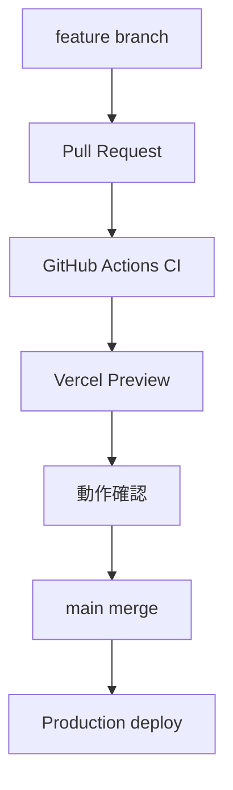
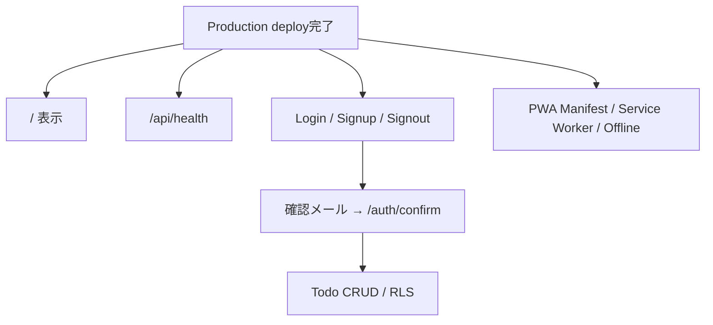

# Deployment to Vercel

## 全体構成



## GitHub連携

Vercel で New Project を作成し、対象 GitHub リポジトリを Import します。Framework Preset は `Next.js` のままで利用します。

## Environment Variables

Vercel Project Settings に以下を登録します。

- `NEXT_PUBLIC_SUPABASE_URL`
- `NEXT_PUBLIC_SUPABASE_PUBLISHABLE_KEY`
- `NEXT_PUBLIC_SITE_URL`（推奨: Production URL）

Production / Preview / Development の適用範囲を確認してください。



## Supabase Auth URL

Supabase Dashboard の Authentication URL Configuration へVercel URLを登録します。

例:

```text
Site URL: https://your-app.vercel.app
Redirect URL: https://your-app.vercel.app/**
```

Preview DeployでAuth確認する場合は、許可するPreview URLの運用方針も決めてください。

## デプロイフロー



## デプロイ後確認



- `/` が表示される
- `/api/health` が `status: ok`
- Login / Signup / Signout
- 確認メールから `/auth/confirm` へ戻れる
- Todo CRUD
- 別ユーザーのTodoをRLSで参照・更新できない
- PWA Manifest / Service Worker / Offline fallback

PWAのService WorkerはProductionでのみ登録します。VercelのHTTPS環境で確認してください。
