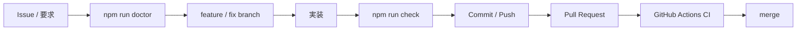
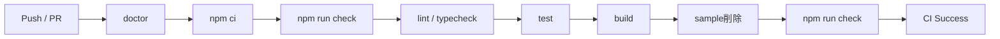
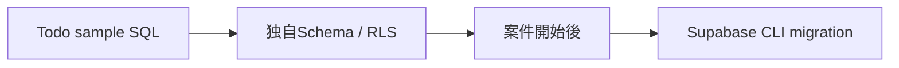
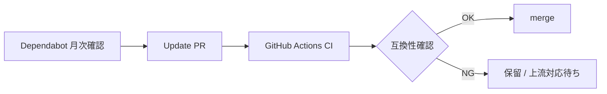

# Development

Git / GitHub / GitHub Desktopの基本用語や、CommitとPushの違い、Pull Request、CI、Squash Mergeの流れがまだ分からない場合は、先に [../BEGINNER-GUIDE.md](../BEGINNER-GUIDE.md) を読んでください。このドキュメントは基本操作を理解した後の日常開発ルールを扱います。

## 基本ルール

変更前後の環境確認にはdoctorを使います。

```powershell
npm run doctor
```

変更後の品質確認は次の1コマンドを基準にします。

```powershell
npm run check
```

`npm run check` は lint → typecheck → test → build を順に実行します。

## 開発フロー



## Doctor

`npm run doctor` は依存パッケージなしで実行できる環境診断です。

確認項目:

- Node.jsが22以上27未満か
- `package.json` / `package-lock.json` / `.env.example` が存在するか
- `.env.local` がある場合、主要Supabase環境変数がサンプル値のままではないか

`.env.local` 未作成やSupabase未設定は警告に留めます。共通トップと `/api/health` はSupabase未設定でも確認できるためです。Node.js対象外や必須Repositoryファイル欠落はFAILとして終了コード1を返します。

## CI 完了報告

CI成功をもって作業完了と報告する場合、最低限以下を併記します。

1. 修正ソース
2. 修正ドキュメント
3. 修正・追加テスト
4. CI結果



CIもローカルと同じ `npm run check` を品質ゲートの入口にします。

## テストの役割分離

テンプレートでは、共通基盤、削除可能なTodoサンプル、テンプレート運用契約のテストを分けます。

```text
tests/core.test.mjs                共通基盤テスト
tests/sample.test.mjs              Todoサンプル専用テスト
tests/doctor.test.mjs              doctor単体テスト
tests/template-lifecycle.test.mjs  開発・運用・拡張契約テスト
```

Todoサンプルを削除する場合は `tests/sample.test.mjs` も一緒に削除します。`tests/core.test.mjs`、doctor、lifecycleテストはTodo固有ファイルの存在に依存しないため、独自アプリでも原則として残します。

新しい業務機能を追加した場合は、その機能のテストを別ファイルとして追加してください。拡張方針は [EXTENDING.md](EXTENDING.md) を参照してください。

## Template smoke test

通常の品質ゲートに加え、CIでは一時workspace上で次のTodoサンプルを削除します。

```text
app/(sample)/dashboard/
features/todos/
supabase/sample/todos.sql
tests/sample.test.mjs
```

その状態でもう一度 `npm run check` を実行し、共通基盤がTodoサンプルへ依存していないことを確認します。

テンプレートの大きな構成変更時には、自動CIだけでなく **Use this template → Clone → 基準check → sample削除 → 独自feature → Pull Request** までを手動で通します。詳細は [TEMPLATE-SMOKE-TEST.md](TEMPLATE-SMOKE-TEST.md) を参照してください。

## Database変更

`supabase/sample/todos.sql` は**Todoサンプル専用**です。共通基盤そのものには固定の業務Schemaを持たせません。

新しいアプリでは、自分のデータモデルとRLSを設計します。案件開始後にDB変更を継続管理する場合はSupabase CLIのmigrationへ移行します。migrationファイルはCLIで生成し、手作業で日時ファイル名を作らない運用にします。



## 依存関係の更新

`.github/dependabot.yml` で npm と GitHub Actions の更新を月1回確認します。

- minor / patch は用途別にグループ化
- major update は原則として個別に確認
- Dependabot PRも通常のPRと同様にCI成功を必須条件として判断
- 依存更新時は `package-lock.json` も同じPRで更新



### ESLint 10について

このテンプレートは現在 ESLint 9系を固定しています。ESLint 9自体はEOLですが、Next.js 16系の `eslint-config-next` は現時点でESLint 10の正式対応が完了しておらず、Next.js側の対応PRも未マージです。

そのため、互換性を無視してESLint 10へ強制更新せず、Dependabotでは `eslint` のmajor updateを一時的にignoreします。Next.jsのstable版で正式対応が確認できた時点でignoreを削除し、`npm ci` / lint / typecheck / test / build をすべて通してからESLint 10へ移行します。追跡はIssue #6で行います。

## 運用への引き渡し

mergeしてVercelへ反映した後の確認、障害切り分け、環境変数変更、ロールバックは [OPERATIONS.md](OPERATIONS.md) を基準にします。

## 公開テンプレートのRepository設定

GitHub上では次の設定を推奨します。

- Template repositoryを有効化
- `main` はPull Request経由で更新
- `quality` CI成功をmerge条件にする
- Force pushを禁止
- merge方式はsquashを基本とする
- merge後の作業ブランチは削除する

Repository設定はソースコードとは別管理のため、変更時はGitHub Settings側も確認してください。

## ブランチ

- `main`: 安定版
- `feature/<name>`: 新機能
- `fix/<name>`: 不具合修正
- `docs/<name>`: ドキュメントのみ
- `chore/<name>`: 保守・設定変更

Issue運用でIssue番号をブランチ名に含める場合は `feature/123-name` や `fix/123-name` のようにします。

## Commit

変更理由が分かる日本語またはConventional Commits形式を推奨します。

```text
feat: ログイン画面を追加
fix: セッション更新処理を修正
docs: Vercelデプロイ手順を更新
```

## Pull Request

PRには目的、変更内容、確認方法、影響範囲、未対応事項を記載します。

GitHub DesktopでBranch作成からPR作成までの具体的な操作を確認したい場合は [../BEGINNER-GUIDE.md](../BEGINNER-GUIDE.md) を参照してください。

## README 更新

セットアップ、環境変数、開発コマンド、デプロイ、運用、拡張契約、CIルールが変わった場合はREADME / docsも同じ変更で更新します。
