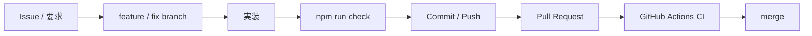
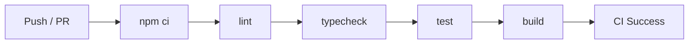
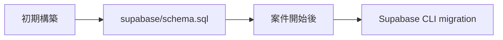

# Development

## 基本ルール

変更後は次を実行します。

```powershell
npm run check
```

## 開発フロー



## CI 完了報告

CI成功をもって作業完了と報告する場合、最低限以下を併記します。

1. 修正ソース
2. 修正ドキュメント
3. 修正・追加テスト
4. CI結果



## Database変更

`supabase/schema.sql` は初期bootstrap用です。案件開始後にDB変更を継続管理する場合はSupabase CLIのmigrationへ移行します。migrationファイルはCLIで生成し、手作業で日時ファイル名を作らない運用にします。



## ブランチ

- `main`: 安定版
- `feature/<name>`: 新機能
- `fix/<name>`: 不具合修正
- `docs/<name>`: ドキュメントのみ

## Commit

変更理由が分かる日本語またはConventional Commits形式を推奨します。

```text
feat: ログイン画面を追加
fix: セッション更新処理を修正
docs: Vercelデプロイ手順を更新
```

## Pull Request

PRには目的、変更内容、確認方法、影響範囲、未対応事項を記載します。

## README 更新

セットアップ、環境変数、開発コマンド、デプロイ、構成、CIルールが変わった場合はREADME / docsも同じ変更で更新します。
