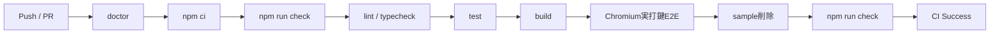
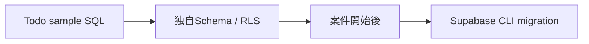
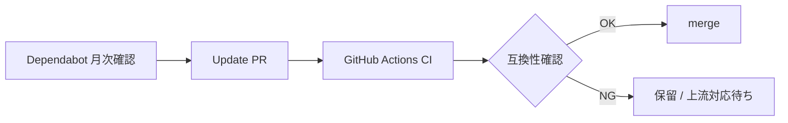

# Development

Git / GitHub / GitHub Desktopの基本用語や、CommitとPushの違い、Pull Request、CI、Squash Mergeの流れがまだ分からない場合は、先に [../BEGINNER-GUIDE.md](../BEGINNER-GUIDE.md) を読んでください。このドキュメントは基本操作を理解した後の日常開発ルールを扱います。

## 基本ルール

変更前後の環境確認にはdoctorを使います。

```powershell
npm run doctor
```

変更後の品質確認は次の1コマンドを基準にします。

```powershell
npm run check
```

`npm run check` は lint → typecheck → test → build を順に実行します。

画面への打鍵・クリックまで確認するときはChromium E2Eを実行します。

```powershell
npm run test:e2e:install
npm run test:e2e
```

`test:e2e:install` はローカル初回だけで構いません。GitHub ActionsではChromiumを自動準備します。

## 開発フロー

```mermaid
flowchart LR
    A["Issue + Verification Plan"] --> D["npm run doctor"]
    D --> B["Issue番号入りbranch"]
    B --> C["実装 / test / docs"]
    C --> Q["npm run check"]
    Q --> E2E["Browser E2E"]
    E2E --> E["Commit / Push"]
    E --> F["Pull Request"]
    F --> G["GitHub Actions CI"]
    G --> V["Risk / Oracle / Independent Verification確認"]
    V --> H["Squash Merge"]
```



mainへ直接Commitせず、日本語Issue → Issue番号入りBranch → Pull Request → `quality` CI → Squash Mergeを基本とします。Contributionルールは [../CONTRIBUTING.md](../CONTRIBUTING.md) を参照してください。

## Verification Design

**CIがGreenであることは品質そのものではなく、定義済みの評価条件を満たしたSignalです。**

振る舞いや品質契約を変更する場合は、実装前にIssueで最低限次を定義します。

- Risk Level: Low / Medium / High
- Important Risk: 何が壊れたら困るか
- Correct State / Test Oracle: 何を正しい状態とするか
- Verification Layer: Static / Contract / Build / Browser E2E / Sampleless / Integration / Manual / Operations
- Blocking Signal: 何が失敗したらMergeを止めるか
- Falsification / Negative Case: 実装が誤っていたら失敗するケース
- Independent Verification: 実装Loopと異なる評価軸

AI / Coding AgentへProduction CodeとTest Codeの両方を任せても構いませんが、AI自身の「全部Greenなので問題ありません」だけを最終Quality Gateにはしません。High Risk変更では、人間のJudgmentまたは実装Loopとは異なる受入観点を残します。

Risk Level、Test Layer、Mutation Testingを標準必須化しない理由などの詳細は [QUALITY-VERIFICATION.md](QUALITY-VERIFICATION.md) を参照してください。

## Doctor

`npm run doctor` は依存パッケージなしで実行できる環境診断です。

確認項目:

- Node.js 22系か
- `package.json` / `package-lock.json` / `.env.example` が存在するか
- `.env.local` がある場合、主要Supabase環境変数が未設定・サンプル値のままではないか
- `NEXT_PUBLIC_SUPABASE_URL` が実アプリと同じ有効なHTTP/HTTPS URLか

`.env.local` 未作成やSupabase未設定・サンプル値は警告に留めます。共通トップと `/api/health` はSupabase未設定でも確認できるためです。一方、設定済みの `NEXT_PUBLIC_SUPABASE_URL` がURLとして不正、HTTP/HTTPS以外、または認証情報を含む場合は設定ミスとしてFAILにします。Node.js対象外や必須Repositoryファイル欠落もFAILとして終了コード1を返します。

## CI 完了報告

CI成功をもって作業完了と報告する場合、最低限以下を併記します。

1. 修正ソース
2. 修正ドキュメント
3. 修正・追加テスト
4. CI結果
5. 重要なRiskと、それを確認したVerification Signal
6. Greenだけでは未保証の範囲が残る場合はその内容



CIもローカルと同じ `npm run check` を品質ゲートの入口にし、その後にPlaywright Chromiumで実ブラウザ操作を確認します。ただしCIがすべてGreenでも、Verification PlanのRiskを観測していない場合はMerge判断の根拠として不十分です。

## テストの役割分離

テンプレートでは、共通基盤、削除可能なTodoサンプル、テンプレート運用契約、ブラウザE2Eを分けます。

```text
tests/core.test.mjs                共通基盤テスト
tests/browser-e2e.test.mjs         ブラウザE2E共通契約テスト
tests/sample.test.mjs              Todoサンプル専用テスト
tests/doctor.test.mjs              doctor単体テスト
tests/template-lifecycle.test.mjs  開発・運用・拡張契約テスト

e2e/auth.spec.mjs                  共通Authの実打鍵E2E
e2e/sample-todos.spec.mjs          Todoサンプル専用の実打鍵・クリックE2E
```

Todoサンプルを削除する場合は `tests/sample.test.mjs` と `e2e/sample-todos.spec.mjs` も一緒に削除します。`tests/core.test.mjs`、`tests/browser-e2e.test.mjs`、`e2e/auth.spec.mjs`、doctor、lifecycleテストはTodo固有ファイルの存在に依存しないため、独自アプリでも原則として残します。

新しい業務機能を追加した場合は、その機能の契約テストとブラウザE2Eを別ファイルとして追加してください。拡張方針は [EXTENDING.md](EXTENDING.md) を参照してください。

振る舞い変更では、正常系だけでなく「実装が誤っていたら失敗する」Falsification観点を最低1つ検討します。例として、不正入力、未認証、他利用者Row、Productionでのfixture隔離、認証RouteのService Worker Cacheなどがあります。

## Browser keyboard E2E

PlaywrightのChromiumを使い、DOMを読むだけでなく実際にフォームへ文字を入力し、ボタンをクリックします。

標準テスト:

- Sign up: メール / パスワードを実打鍵
- 8文字未満パスワードのHTML Validation
- Login: メール / パスワードを実打鍵して送信
- Todo: タイトルを実打鍵して追加
- Todo: 完了状態をクリックで切替
- Todo: 削除ボタンをクリック

E2Eでは実Supabase・確認メール・本番DBを使わず、テスト専用fixtureを使用します。これによりPRごとに安定して画面操作を検証できます。

```text
E2E_TEST_MODE=1
かつ
NODE_ENV != production
```

の場合だけfixtureが有効です。Productionでは `E2E_TEST_MODE=1` が誤設定されてもfixtureへ切り替わりません。

実SupabaseのAuth / RLS / Vercel Production接続は、このE2Eとは別の受入確認として扱います。Browser E2EがGreenでも、実Supabase固有のRLS・確認メール・Production envまでは保証しません。

## Template smoke test

通常の品質ゲートとBrowser E2Eに加え、CIでは一時workspace上で次のTodoサンプルを削除します。

```text
app/(sample)/
features/todos/
supabase/sample/todos.sql
tests/sample.test.mjs
e2e/sample-todos.spec.mjs
```

その状態でもう一度 `npm run check` を実行し、共通基盤がTodoサンプルへ依存していないことを確認します。

テンプレートの大きな構成変更時には、自動CIだけでなく **Use this template → Clone → 基準check → Browser E2E → sample削除 → 独自feature → Pull Request** までを通します。詳細は [TEMPLATE-SMOKE-TEST.md](TEMPLATE-SMOKE-TEST.md) を参照してください。

独自featureへ置換したら、`e2e/sample-todos.spec.mjs` をそのまま残すのではなく、そのfeatureの主要入力・更新・削除などを操作するE2Eへ置き換えます。

## Database変更

`supabase/sample/todos.sql` は**Todoサンプル専用**です。共通基盤そのものには固定の業務Schemaを持たせません。

新しいアプリでは、自分のデータモデルとRLSを設計します。案件開始後にDB変更を継続管理する場合はSupabase CLIのmigrationへ移行します。migrationファイルはCLIで生成し、手作業で日時ファイル名を作らない運用にします。

Schema / RLS / GRANTはHigh Riskとして扱い、SQLが実行できることだけでなく「誰がどのRowを読める・変更できるか」をTest Oracleとして確認します。



## 依存関係の更新

`.github/dependabot.yml` で npm と GitHub Actions の更新を月1回確認します。

- minor / patch は用途別にグループ化
- major update は原則として個別に確認
- Dependabot PRも通常のPRと同様にCI成功を必須条件として判断
- 依存更新時は `package-lock.json` も同じPRで更新
- PlaywrightはdevDependencyとして固定し、package-lock.jsonで再現可能にする。更新時はBrowser E2Eを必ず通す
- major updateはHigh Riskとして、Release Note / compatibilityとRollback観点も確認



### ESLint 10について

このテンプレートは現在 ESLint 9系を固定しています。ESLint 9自体はEOLですが、Next.js 16系の `eslint-config-next` は現時点でESLint 10の正式対応が完了しておらず、Next.js側の対応PRも未マージです。

そのため、互換性を無視してESLint 10へ強制更新せず、Dependabotでは `eslint` のmajor updateを一時的にignoreします。Next.jsのstable版で正式対応が確認できた時点でignoreを削除し、`npm ci` / lint / typecheck / test / build をすべて通してからESLint 10へ移行します。追跡はIssue #6で行います。

## 運用への引き渡し

mergeしてVercelへ反映した後の確認、障害切り分け、環境変数変更、ロールバックは [OPERATIONS.md](OPERATIONS.md) を基準にします。

## 公開テンプレートのRepository設定

GitHub上では次の設定を推奨します。

- Template repositoryを有効化
- `main` はPull Request経由で更新
- `quality` CI成功をmerge条件にする
- Force pushを禁止
- merge方式はsquashを基本とする
- merge後の作業ブランチは削除する

Repository設定はソースコードとは別管理のため、変更時はGitHub Settings側も確認してください。

## ブランチ

- `main`: 安定版
- `feature/<name>`: 新機能
- `fix/<name>`: 不具合修正
- `docs/<name>`: ドキュメントのみ
- `chore/<name>`: 保守・設定変更

Issue運用でIssue番号をブランチ名に含める場合は `feature/123-name` や `fix/123-name` のようにします。

## Commit

変更理由が分かる日本語またはConventional Commits形式を推奨します。

```text
feat: ログイン画面を追加
fix: セッション更新処理を修正
docs: Vercelデプロイ手順を更新
```

## Pull Request

`.github/pull_request_template.md` を使い、最低限次を記載します。

- 対応Issue
- 変更内容
- Verification Plan
- Greenが保証する範囲 / Greenだけでは保証しない範囲
- テスト
- 影響範囲
- Supabase / Auth / env / PWA / dependency / deploy影響
- README / docs更新

GitHub DesktopでBranch作成からPR作成までの具体的な操作を確認したい場合は [../BEGINNER-GUIDE.md](../BEGINNER-GUIDE.md) を参照してください。

## README 更新

セットアップ、環境変数、開発コマンド、デプロイ、運用、拡張契約、CIルール、ブラウザE2E、Verification Designが変わった場合はREADME / docsも同じ変更で更新します。
