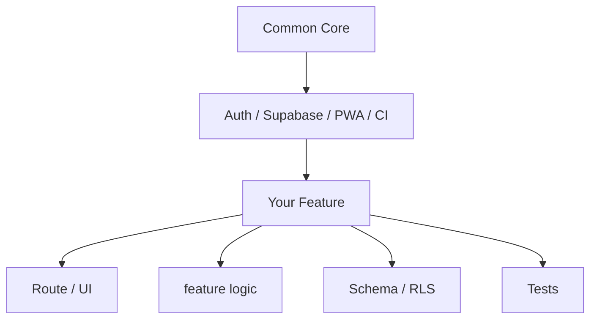
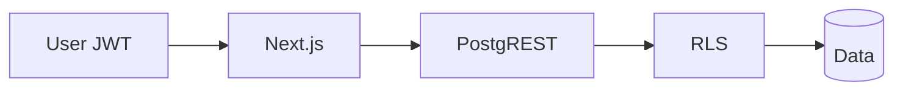
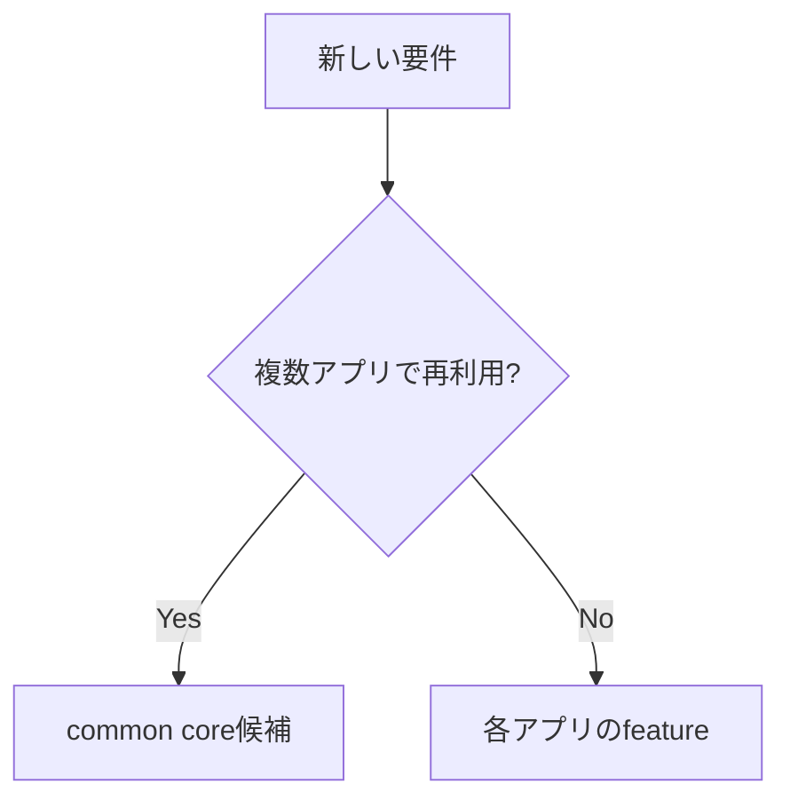

# Extending the Template

このドキュメントは、Todoサンプルをコピーすること自体を目的にせず、共通基盤を維持したまま独自featureを追加するための設計契約です。

## 基本方針



共通基盤に案件固有のtable名、画面、通知、外部APIを直接混ぜず、feature単位で境界を作ります。

## 1. 推奨配置

例: 設備管理feature

```text
app/(app)/equipment/          Route / Page
features/equipment/           Server Action / validation / domain logic
supabase/migrations/          案件開始後のSchema / RLS migration
tests/equipment.test.mjs      feature固有テスト
```

Route Group名はURLへ出ません。アプリの構成に合わせて `(app)` などを選びます。

## 2. Server / Clientの責務

- Server Componentを基本にする
- Client ComponentはブラウザAPI・イベント・local stateが必要な範囲へ限定
- Secretやservice roleをClientへ渡さない
- 更新処理はServer Action / Route Handler等のserver境界へ寄せる
- owner / roleの最終認可はRLSにも持たせる

## 3. Supabase Schema / RLS

新しい業務tableを追加するときは、最低限次を決めます。

- Primary Key
- ownerまたは共有範囲
- created / updated timestamp
- anon / authenticated / adminそれぞれのSELECT権限
- INSERT / UPDATE / DELETE条件
- GRANT
- RLS policy



UIでボタンを隠すだけでは認可になりません。

## 4. Migration

テンプレート確認用sample SQLと、実案件の継続migrationを分けます。

- 新規アプリの設計開始後はSupabase CLI migrationへ移行
- 適用済みmigrationを後から編集しない
- migration filenameはSupabase CLIで生成
- destructive変更は復旧方法とセットでレビュー

## 5. テスト

共通基盤テスト `tests/core.test.mjs` は維持し、新featureの仕様を別ファイルへ追加します。

最低限の観点:

- 未認証 / 認証済み境界
- owner Aがowner Bのデータを操作できない
- 入力不正
- 正常CRUD
- RLS / SQL定義の存在
- 共通サンプルを削除してもcore testが成立

## 6. PWA / Cache

認証画面、private画面、APIレスポンスを安易にCacheしません。新しいprivate routeを追加した場合、`public/sw.js` の除外条件も確認します。

## 7. 環境変数

新しい環境変数を追加するときは:

1. Server onlyかbrowser公開可か判断
2. browser公開可の場合のみ `NEXT_PUBLIC_` を使用
3. `.env.example` に名前と用途を追加
4. Vercel Preview / Productionへ設定
5. `npm run doctor` / `npm run check` を確認

## 8. 共通基盤を変更する判断

複数の独立アプリで再利用できるものだけをテンプレート本体へ戻します。



## 9. Feature追加チェックリスト

- featureの責務が1文で説明できる
- Route / domain logic / DB / testの境界が分かる
- RLSが最終認可境界になっている
- SecretをClientへ公開していない
- private routeをPWA cacheしていない
- `.env.example` が最新
- `npm run doctor` が致命的エラーなし
- `npm run check` 成功
- PR CI成功
- README / docsを必要に応じて更新

## 10. Todoサンプルとの関係

Todoは認証・CRUD・RLSの参考実装です。独自featureを作る際に設計が合わなければ、Todoの構造へ無理に寄せる必要はありません。共通基盤の契約を守り、独自featureとして設計してください。
