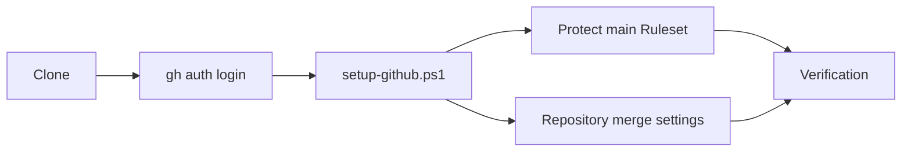
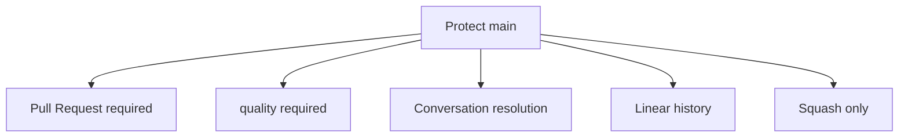
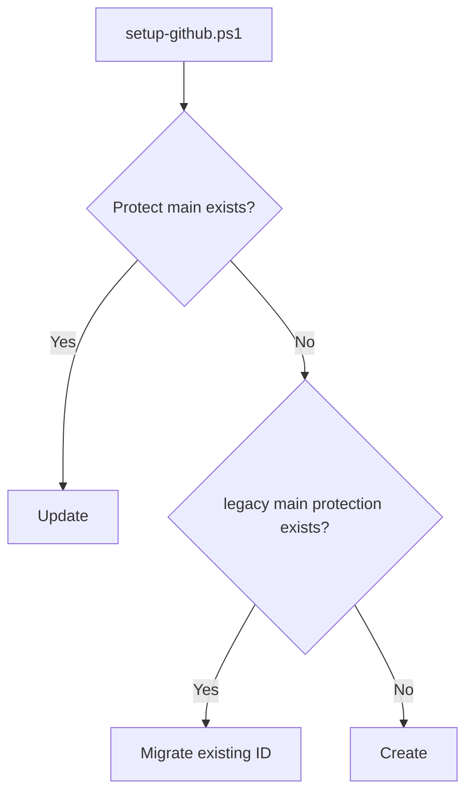

# GitHub Setup

このドキュメントは、このテンプレートから作成したRepositoryへ、main保護・Pull Request・CI・Squash Mergeの推奨設定を適用する方法を説明します。

Git / GitHub / GitHub Desktopの基本操作が分からない場合は、先に [../BEGINNER-GUIDE.md](../BEGINNER-GUIDE.md) を読んでください。

## 全体像



## 1. GitHub CLIを準備する

Windows PowerShell:

```powershell
gh --version
gh auth login
```

`gh` が未導入でwingetを利用できる場合:

```powershell
winget install --id GitHub.cli
```

設定には対象Repositoryの管理権限が必要です。

## 2. 推奨設定を適用する

CloneしたRepositoryのルートで:

```powershell
.\scripts\setup-github.ps1
```

対象を明示する場合:

```powershell
.\scripts\setup-github.ps1 -Repository owner/repository
```

## 3. 適用されるRepository設定

- Squash Merge = ON
- Merge commit = OFF
- Rebase merge = OFF
- Auto merge = OFF
- Merge後のhead branch自動削除 = ON
- Pull Request branchのUpdate提案 = ON

## 4. Protect main Ruleset

`github/protect-main.ruleset.json` でDefault branchへ次を設定します。

- main削除禁止
- Force push禁止
- Linear history必須
- Pull Request必須
- Conversation resolution必須
- Squash Mergeのみ
- Bypassなし
- Required Status Check: `quality`



## 5. 初回実行と再実行

スクリプトは同名Rulesetが無い場合は作成し、存在する場合は既存IDを更新します。再実行しても同じRulesetを更新するため、重複作成しません。

このテンプレートの旧設定で使われていた `main protection` が存在する場合も、互換処理で既存IDを認識して `Protect main` へ更新します。



## 6. CIとRuleset

現在のCI job名は `quality` です。`.github/workflows/ci.yml` のjob名を変更する場合は、同じPRで `github/protect-main.ruleset.json` のRequired Check名も確認してください。

一致しないCheck名をRequiredにすると、CIが成功していてもMergeできなくなる可能性があります。

## 7. Windows PowerShell 5.1互換性

`scripts/setup-github.ps1` はUTF-8 BOM付きで管理します。`.editorconfig` でもこのファイルだけ `utf-8-bom` を指定し、CIでBOMとPowerShell構文を確認します。

## 8. 設定後の開発フロー


GitHub Desktopでこの流れを一度練習する手順は [../BEGINNER-GUIDE.md](../BEGINNER-GUIDE.md) を参照してください。

## 9. よくあるエラー

### `gh` が見つからない

GitHub CLIを導入します。

### GitHubへログインしていない

```powershell
gh auth login
```

### 管理権限がない

RulesetやRepository merge設定の変更には管理権限が必要です。

### CI成功後もMergeできない

`quality` の実際のCheck名とRuleset定義を確認します。CI job名を変えた直後は特に注意してください。

## 関連ドキュメント

- [../BEGINNER-GUIDE.md](../BEGINNER-GUIDE.md)
- [../GETTING-STARTED.md](../GETTING-STARTED.md)
- [DEVELOPMENT.md](DEVELOPMENT.md)
- [DEPLOYMENT.md](DEPLOYMENT.md)
