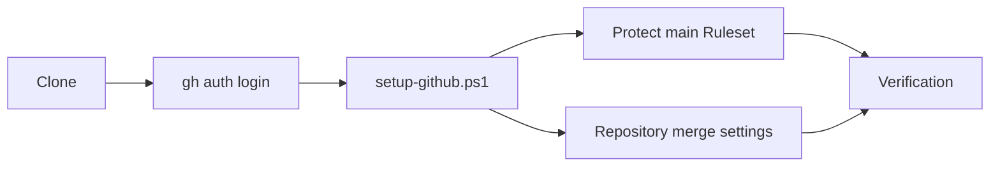
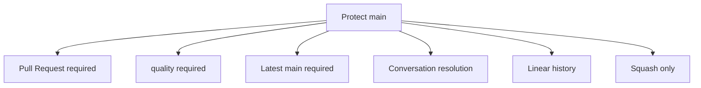
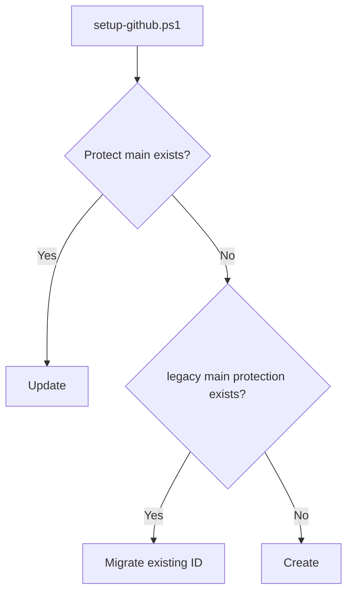
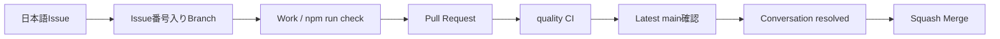

# GitHub Setup

このドキュメントは、このテンプレートから作成したRepositoryへ、main保護・Pull Request・CI・Squash Mergeの推奨設定を適用する方法を説明します。

Git / GitHub / GitHub Desktopの基本操作が分からない場合は、先に [../BEGINNER-GUIDE.md](../BEGINNER-GUIDE.md) を読んでください。

## 全体像



## 1. GitHub CLIを準備する

Windows PowerShell:

```powershell
gh --version
gh auth login
```

`gh` が未導入でwingetを利用できる場合:

```powershell
winget install --id GitHub.cli
```

設定には対象Repositoryの管理権限が必要です。

## 2. 推奨設定を適用する

CloneしたRepositoryのルートで:

```powershell
.\scripts\setup-github.ps1
```

対象を明示する場合:

```powershell
.\scripts\setup-github.ps1 -Repository owner/repository
```

## 3. 適用されるRepository設定

- Squash Merge = ON
- Merge commit = OFF
- Rebase merge = OFF
- Auto merge = OFF
- Merge後のhead branch自動削除 = ON
- Pull Request branchのUpdate提案 = ON

## 4. Protect main Ruleset

`github/protect-main.ruleset.json` でDefault branchへ次を設定します。

- main削除禁止
- Force push禁止
- Linear history必須
- Pull Request必須
- Conversation resolution必須
- Squash Mergeのみ
- Bypassなし
- Required Status Check: `quality`
- **Required Status ChecksはStrict**

Strictでは、PRの `quality` が一度Greenになっていても、その後mainが更新された場合は最新mainとの組み合わせで再確認してからMergeします。古いbaseでGreenだったPRをそのまま取り込まないための設定です。



## 5. 初回実行と再実行

スクリプトは同名Rulesetが無い場合は作成し、存在する場合は既存IDを更新します。再実行しても同じRulesetを更新するため、重複作成しません。

このテンプレートの旧設定で使われていた `main protection` が存在する場合も、互換処理で既存IDを認識して `Protect main` へ更新します。



Required CheckやStrict条件が変わった場合も、`setup-github.ps1` を再実行してRepository設定を定義ファイルへ同期します。

## 6. CIとRuleset

現在のCI job名は `quality` です。`.github/workflows/ci.yml` のjob名を変更する場合は、同じPRで `github/protect-main.ruleset.json` のRequired Check名も確認してください。

一致しないCheck名をRequiredにすると、CIが成功していてもMergeできなくなる可能性があります。

## 7. GitHub Actions Supply Chain

外部GitHub Actionはfloating tagではなく、確認済みの**full commit SHA**へ固定します。

```yaml
uses: actions/checkout@<40-character-commit-sha> # v7
```

- full SHAを実行対象の不変な参照として扱う
- 可読性のため末尾コメントに対応major versionを残す
- `.github/dependabot.yml` の `github-actions` 更新で新しい既知良好SHAを追跡する
- Action更新PRも通常CIを通してから取り込む

lifecycle testはCI内の外部 `uses:` が40文字SHAで固定されていることを確認します。

## 8. CI内容

現在の `quality` jobでは:

- GitHub設定スクリプトのBOM / PowerShell構文
- Node.js 22
- Doctor
- `npm ci`
- lint / typecheck / test / production build
- Playwright Chromium Browser keyboard E2E
- Todoサンプル削除後のsampleless template smoke test
- Repository内Markdownリンク整合性

を確認します。

## 9. Windows PowerShell 5.1互換性

`scripts/setup-github.ps1` はUTF-8 BOM付きで管理します。`.editorconfig` でもこのファイルだけ `utf-8-bom` を指定し、CIでBOMとPowerShell構文を確認します。

## 10. 設定後の確認

GitHub画面では `Settings` → `Rules` → `Rulesets` から `Protect main` を確認できます。Required Status Checksの **Require branches to be up to date before merging** 相当が有効であることも確認します。

RepositoryのPull Request設定では、Squash Mergeのみ、Merge後branch削除、Update branch提案が有効であることを確認します。

## 11. 公開テンプレートの表示設定

テンプレート本体を公開Repositoryとして運用する場合は、次を推奨します。

- Template repository = ON
- Wiki = OFF（正本ドキュメントをREADME / `docs/`へ集約）
- Topics例: `nextjs`, `supabase`, `vercel`, `typescript`, `pwa`, `webapp-template`, `starter-template`

この表示設定は派生アプリでは用途が変わるため、`setup-github.ps1` から強制しません。テンプレート本体または各Repositoryの管理者が用途に合わせて設定します。

## 12. 設定後の開発フロー



GitHub Desktopでこの流れを一度練習する手順は [../BEGINNER-GUIDE.md](../BEGINNER-GUIDE.md) を参照してください。

## 13. よくあるエラー

### `gh` が見つからない

GitHub CLIを導入します。

### GitHubへログインしていない

```powershell
gh auth login
```

### 管理権限がない

RulesetやRepository merge設定の変更には管理権限が必要です。

### `Resource not accessible by integration`

ChatGPT等のGitHub Appを使う場合、対象RepositoryがAppのRepository accessへ含まれているか確認します。Ruleset、Topics、Wiki等のRepository管理設定は、接続AppにAdministration writeが無い場合は変更できません。

### CI成功後もMergeできない

`quality` の実際のCheck名とRuleset定義を確認します。Strict Rulesetではmain更新後にPR branchの更新が必要になる場合があります。

## 関連ドキュメント

- [../BEGINNER-GUIDE.md](../BEGINNER-GUIDE.md)
- [../GETTING-STARTED.md](../GETTING-STARTED.md)
- [../.github/SECURITY.md](../.github/SECURITY.md) - 脆弱性報告ポリシー
- [DEVELOPMENT.md](DEVELOPMENT.md)
- [QUALITY-VERIFICATION.md](QUALITY-VERIFICATION.md)
- [DEPLOYMENT.md](DEPLOYMENT.md)
