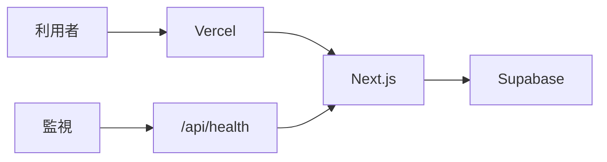
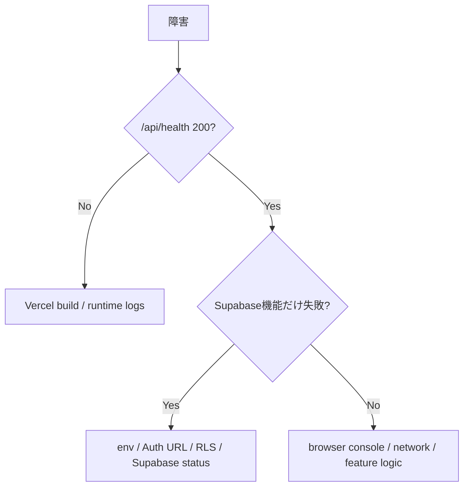
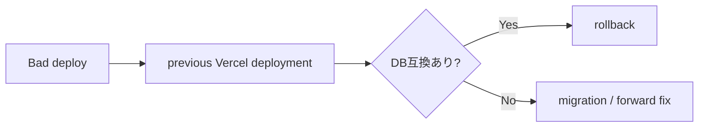

# Operations Runbook

このドキュメントは、このテンプレートから作成したNext.js / Supabase / Vercelアプリを日常運用するときの共通Runbookです。案件固有の監視・連絡先・業務手順は各アプリ側で追記します。

## 全体像

## 1. 日常確認

- Vercelの最新Production Deploymentが成功している
- `/api/health` がHTTP 200を返す
- Supabase Dashboardで停止・障害通知が出ていない
- Dependabot PRやGitHub Actions失敗が放置されていない

`/api/health` はアプリプロセスの生存確認用です。秘密情報や利用者データを返さず、Supabaseへの実データ問い合わせも行いません。

## 2. デプロイ前

1. 対応IssueとPRを確認
2. `npm run doctor`
3. `npm run check`
4. Database変更がある場合はSQL / RLS / migration内容を確認
5. 環境変数追加・変更がある場合は `.env.example` とVercel設定を同じ変更で更新
6. GitHub Actions CI成功後にmerge

## 3. デプロイ後

- Vercel DeploymentがReadyになったことを確認
- `/api/health` を確認
- Auth変更時はLogin / Sign up / Confirmを確認
- Database変更時は対象機能を最小1ケース確認
- PWA変更時はService Worker / offline動作を確認

## 4. 障害切り分け

### `/api/health` が失敗する

- Vercel Deployment状態
- Build / Runtime Log
- Node.js version
- 直近merge差分

### Authだけ失敗する

- `NEXT_PUBLIC_SUPABASE_URL`
- `NEXT_PUBLIC_SUPABASE_PUBLISHABLE_KEY`
- Supabase Authentication > URL Configuration
- Redirect URL / Site URL
- Cookie / proxy処理

### CRUDだけ失敗する

- 対象table / GRANT
- RLS policy
- `auth.uid()` とowner列
- browser NetworkのHTTP status / response

## 5. 環境変数変更

- Secret Key / `service_role` / DB passwordを `NEXT_PUBLIC_` に置かない
- 値をGitHubへCommitしない
- 変数名を追加・削除したら `.env.example` とドキュメントを更新
- VercelではPreview / Productionの対象Environmentを確認
- 変更後は再デプロイして反映を確認

## 6. Database変更

サンプル段階では `supabase/sample/`、案件開始後はSupabase CLI migrationを利用します。

- 適用済みmigrationを書き換えない
- RLSを無効化したまま運用しない
- owner列をクライアント入力だけで決めない
- destructive変更はバックアップ・復旧方針を先に決める

## 7. ロールバック

アプリ側の不具合は、Vercelの直前の正常Deploymentへ戻すことを第一候補にします。ただしDatabase migrationを伴う場合、アプリだけ戻して互換性が壊れないか先に確認します。

## 8. 依存関係

Dependabot更新は通常のPRと同じく `npm run check` とCI成功を条件に取り込みます。ESLint 10はIssue #6のとおりNext.js上流の正式対応後に更新します。

## 9. 各アプリ側で追記するもの

- 本番URL
- Supabase Project名
- 監視方法
- 障害連絡先
- バックアップ / 復旧要件
- 業務上の停止可能時間
- 外部APIやWebhookの運用
