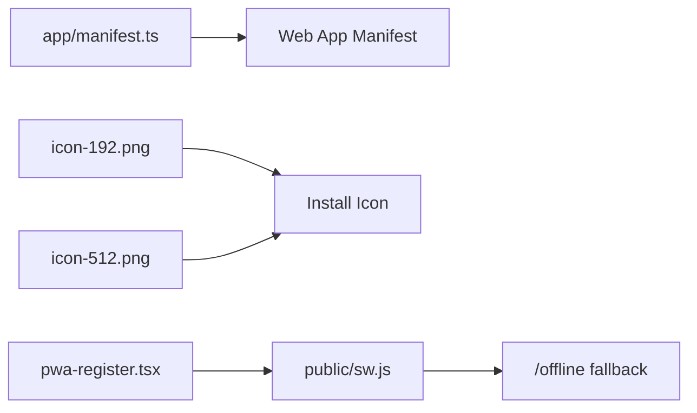
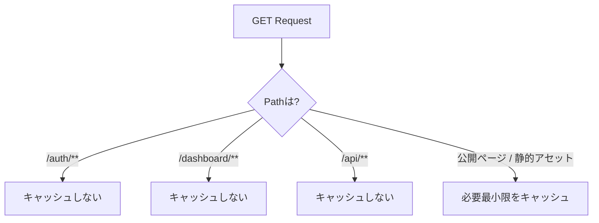
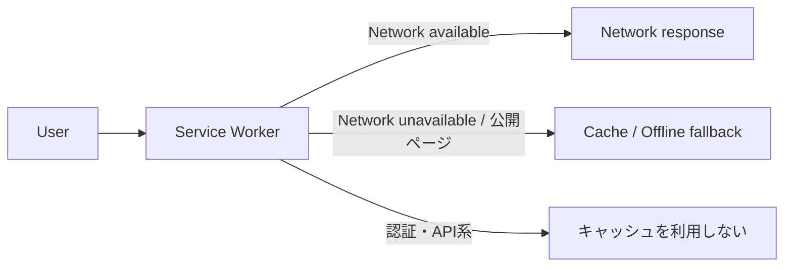

# PWA

## 構成

- `app/manifest.ts` Web App Manifest
- `public/icon-192.png` / `public/icon-512.png` インストール用アイコン
- `components/pwa-register.tsx` Service Worker 登録
- `public/sw.js` キャッシュ処理
- `/offline` オフラインフォールバック

Service Worker はProductionビルドでのみ登録します。開発中の古いキャッシュによる混乱を避けるためです。

## キャッシュ方針

ユーザー固有データを端末キャッシュへ残さないため、次のパスはService Workerでキャッシュしません。

- `/auth/**`
- `/dashboard/**`
- `/api/**`

静的アセットと公開ページの最低限だけを対象にしています。案件固有のオフライン要件がある場合は、認証情報・個人情報・機密情報の扱いを決めてからキャッシュ対象を拡張してください。

## オフライン時の考え方

## HTTPS

Service Worker / PWA は本番ではHTTPSが前提です。VercelデプロイではHTTPSが自動提供されます。
