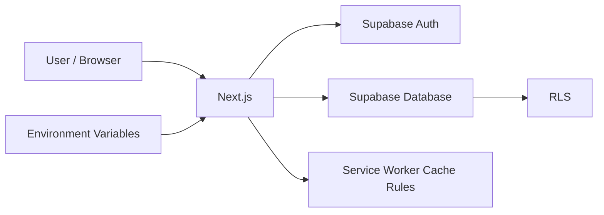
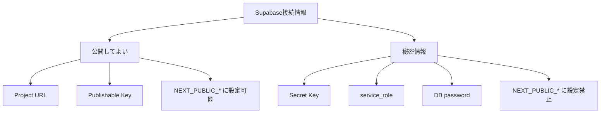
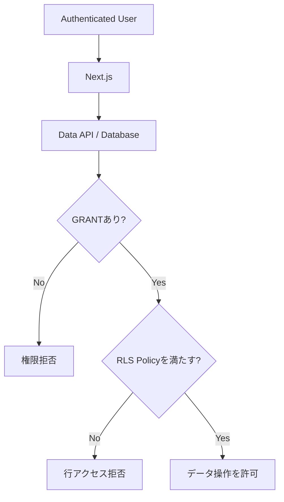
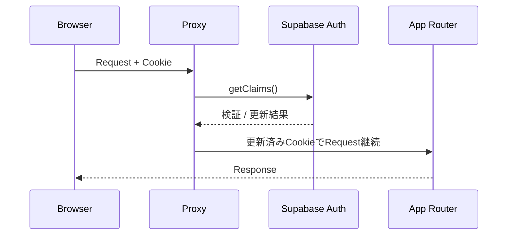

# Security

## セキュリティ全体像

## Supabase API Key

フロントエンドで使用可能:

- Project URL
- Publishable Key

フロントエンドで使用禁止:

- Secret Key
- `service_role`
- DB password

`NEXT_PUBLIC_` が付いた環境変数はブラウザへ公開される前提で扱います。

## RLS

Data APIからアクセスするテーブルではRLSを有効にします。削除可能なTodoサンプル `supabase/sample/todos.sql` は、`authenticated` へ必要なGRANTだけを付与し、各操作で所有者条件を入れています。

Todoサンプルを削除して独自Schemaへ置き換える場合も、この方針を維持します。

`TO authenticated` だけでは所有者認可にはなりません。必ず `auth.uid()` 等で行単位の条件を設定します。

UPDATE Policyでは `USING` と `WITH CHECK` の両方を設定します。

## Data API grants

新規Supabaseプロジェクトでは、作成したテーブルがData APIへ自動公開されない場合があります。RLSとGRANTは別の層です。API経由で利用するテーブルには必要最小限のGRANTを明示し、同時にRLSを有効にします。

## Authorization data

ユーザーが編集可能な `user_metadata` を権限判定には使用しません。権限情報が必要な場合は信頼できるDBデータまたは適切に管理した `app_metadata` を利用します。

## Auth session

`@supabase/ssr` の Cookie-based Auth を利用し、Proxyで `getClaims()` を呼びトークンを検証・更新します。Supabaseがセッション更新時に渡すanti-cache headersもResponseへ引き継ぎます。

## PWA cache

Service Workerは `/auth`、`/dashboard`、`/api` をキャッシュしません。機密データをオフラインキャッシュへ追加する場合は案件ごとのセキュリティレビューを必須とします。

## Secrets

`.env.local`、秘密鍵、認証情報をGitへコミットしません。誤ってコミットした場合はキーを失効・ローテーションし、必要に応じて履歴から除去します。
