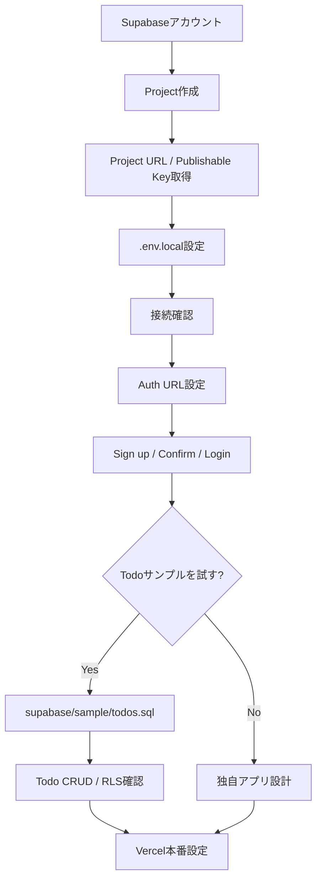
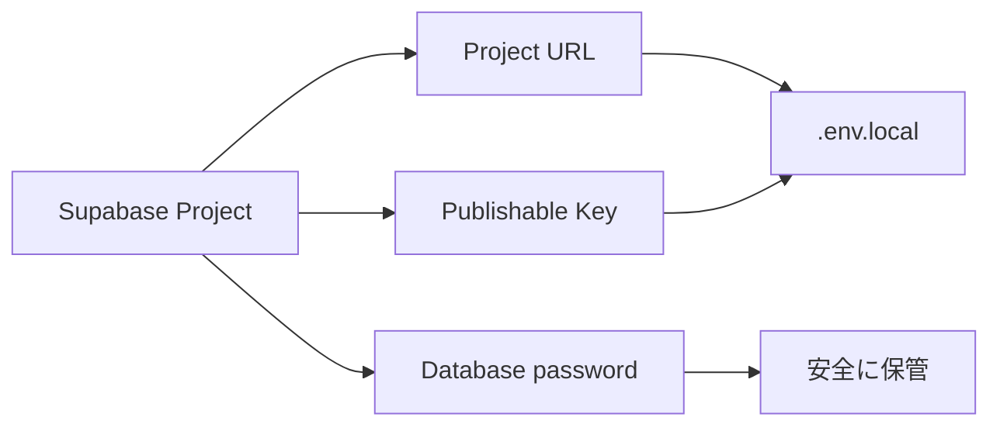
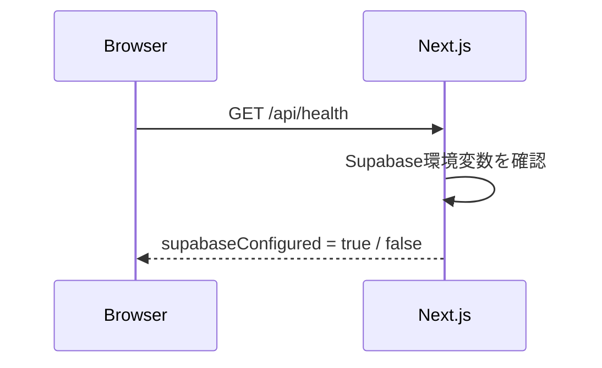
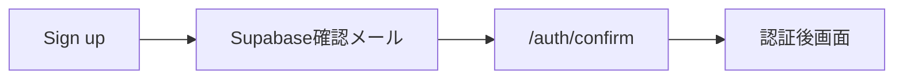
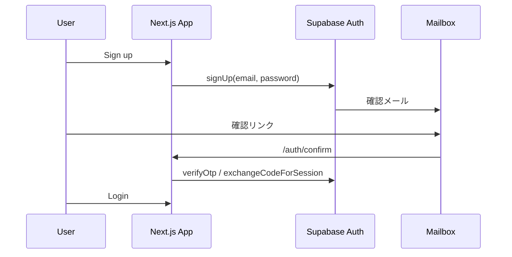
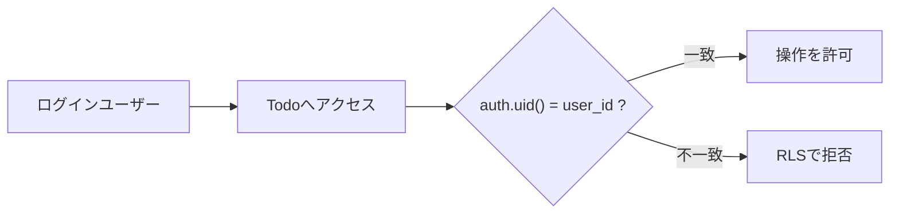

# Supabase セットアップ手順

このドキュメントは、このテンプレートから新しいWebアプリを作る利用者が、**Supabase Project作成 → 接続 → Auth設定 → 必要ならTodo CRUD / RLSサンプル確認 → Vercel設定**までを順番に進めるための手順です。

Todo CRUDは削除可能なサンプルです。Supabase接続やAuthを使うだけなら、Todo用SQLを実行する必要はありません。

## セットアップ全体像



## 1. Supabaseアカウントを準備する

Supabaseへサインインし、Dashboardを開きます。

- Supabase: https://supabase.com/
- Project作成: https://database.new/

GitHubアカウントなどでサインインできます。Organizationがまだ無い場合はDashboardの案内に従って作成します。

## 2. 新しいProjectを作成する

Supabase Dashboardから新しいProjectを作成します。

入力する主な項目:

- **Project name**: 作成するアプリが分かる名前
- **Database password**: 十分に強いパスワード
- **Region**: 主な利用者に近いリージョン
- **Plan**: 開発・検証・本番の要件に合うプラン

Database passwordはDB管理用の秘密情報です。

**このテンプレートの `.env.local` には設定しません。GitHubにもコミットしないでください。** パスワードマネージャーなどで安全に保管します。



Project作成後、Databaseなどの準備が完了するまで待ちます。

## 3. Project URLとPublishable Keyを取得する

Projectを開き、Dashboardの **Connect** からAPI接続情報を確認します。

このテンプレートでブラウザ接続に使うのは次の2つです。

- **Project URL**
- **Publishable Key**

例:

```text
Project URL:
https://xxxxxxxxxxxxxxxxxxxx.supabase.co

Publishable Key:
sb_publishable_xxxxxxxxxxxxxxxxxxxx
```

### 使用しない秘密情報

次を `NEXT_PUBLIC_` へ設定しません。

- Secret Key
- `service_role` key
- Database password

このテンプレートは `NEXT_PUBLIC_SUPABASE_PUBLISHABLE_KEY` を使用します。

## 4. `.env.local` を作成する

リポジトリのルートで `.env.example` をコピーします。

Windows PowerShell:

```powershell
Copy-Item .env.example .env.local
```

macOS / Linux:

```bash
cp .env.example .env.local
```

`.env.local` を次のように設定します。

```env
NEXT_PUBLIC_SUPABASE_URL=https://xxxxxxxxxxxxxxxxxxxx.supabase.co
NEXT_PUBLIC_SUPABASE_PUBLISHABLE_KEY=sb_publishable_xxxxxxxxxxxxxxxxxxxx
```

ローカル開発だけなら、まずはこの2項目で構いません。

本番URLが確定したらProduction環境では次も設定します。

```env
NEXT_PUBLIC_SITE_URL=https://your-app.example.com
```

`.env.local` は `.gitignore` 対象です。**GitHubへコミットしないでください。**

## 5. Supabase接続を確認する

開発サーバーを起動します。

```powershell
npm run dev
```

ブラウザで次を開きます。

```text
http://localhost:3000/api/health
```



`supabaseConfigured` が `true` なら環境変数が読み込まれています。

`false` の場合は次を確認します。

- `.env.local` がリポジトリ直下にあるか
- 変数名に誤字がないか
- URL / Publishable Keyの前後に不要な空白がないか
- `.env.local` 変更後に開発サーバーを再起動したか

## 6. Email / Password認証を確認する

Supabase hosted projectではEmail認証を利用できます。Dashboardで **Authentication → Providers** を開き、Email providerを確認します。

テンプレートの標準動作では次を想定しています。

- Email provider: 有効
- 新規Sign up: 有効
- Confirm Email: 有効

開発中にメール確認を無効化することもできますが、本番用途ではメール確認を有効にすることを推奨します。

## 7. AuthのSite URL / Redirect URLを設定する

Dashboardで **Authentication → URL Configuration** を開きます。

ローカル開発では次を設定します。

```text
Site URL
http://localhost:3000
```

Additional Redirect URLsへ次を追加します。

```text
http://localhost:3000/**
```

このテンプレートのSign upは確認後の戻り先として `/auth/confirm` を使用します。



### Vercel本番公開後

本番URLをSite URLへ設定し、Additional Redirect URLsにも追加します。

例:

```text
Site URL:
https://my-app.vercel.app

Additional Redirect URL:
https://my-app.vercel.app/**
```

Preview URLでAuthを確認する場合だけ、Preview用URLも許可します。本番では不必要に広いワイルドカードを設定しないでください。

## 8. 確認メール

まずはSupabase標準の確認メールで動作確認できます。

このテンプレートの `/auth/confirm` は次の両方を処理できます。

- PKCE `code`
- `token_hash` + `type`

SSR向けに確認メールをカスタマイズする場合はSupabaseのEmail TemplatesでToken Hashを使う方式を利用できます。

```text
Authentication → Email Templates → Confirm signup
```

本番で実ユーザーへメールを送る場合は、Supabase標準送信機能の制限を確認してください。任意の実ユーザーへ安定してメールを送る本番用途では **Custom SMTP** を設定します。

本番公開前には次も確認します。

- 独自SMTPから確認メールが届く
- Fromアドレス / ドメインが適切
- Confirm signupが正常に完了する
- Password resetメールも正常に届く

## 9. Sign up → Loginを確認する

開発サーバーを起動した状態で次を確認します。



### Sign up

```text
http://localhost:3000/auth/sign-up
```

1. メールアドレスを入力
2. 8文字以上のパスワードを入力
3. Sign up
4. 確認メールを受信
5. 確認リンクを開く

Supabase Dashboardの **Authentication → Users** でもユーザー作成を確認できます。

### Login

```text
http://localhost:3000/auth/login
```

確認済みのメールアドレスとパスワードでログインします。

## 10. Todoサンプル用Databaseを作成する（任意）

**ここからはTodo CRUD / RLSサンプルを試す場合だけ実施します。** 独自アプリをすぐ作る場合は、この章を飛ばして自分のSchema / RLSを設計して構いません。

Supabase Dashboardで **SQL Editor** を開き、リポジトリ内の次のファイルを実行します。

```text
supabase/sample/todos.sql
```

このSQLは次を行います。

- `public.todos` テーブル作成
- `user_id` と `auth.users` の関連付け
- RLS有効化
- `anon` の権限削除
- `authenticated` へ必要なCRUD権限を付与
- SELECT / INSERT / UPDATE / DELETE の所有者RLS Policy作成

所有者判定の基本は次です。

```sql
auth.uid() = user_id
```



SQL実行後、Table Editorなどから `todos` が作成されたことを確認します。

RLSを無効化して動作確認することは避けてください。

> `supabase/sample/todos.sql` はTodoサンプル専用です。独自アプリでは、このファイルを削除し、自分のデータモデル・GRANT・RLS Policyへ置き換えてください。

## 11. Todo CRUD / RLSを確認する（任意）

Todoサンプルを残している場合、ログイン後に次を開きます。

```text
http://localhost:3000/dashboard
```

確認内容:

- Todo追加
- Todo完了 / 未完了切替
- Todo削除
- Sign out

さらに別ユーザーを2人作成し、一方のTodoが他方から見えないことまで確認するとRLSの動作確認になります。

Todoサンプルの実装は次の4か所に分離されています。

```text
app/(sample)/dashboard/
features/todos/
supabase/sample/todos.sql
tests/sample.test.mjs
```

Todoを使わない独自アプリでは、この4か所をまとめて削除できます。

## 12. Vercelへ環境変数を設定する

Vercelへデプロイする場合、ProjectのEnvironment Variablesへ次を設定します。

必須:

```text
NEXT_PUBLIC_SUPABASE_URL
NEXT_PUBLIC_SUPABASE_PUBLISHABLE_KEY
```

Productionでは追加:

```text
NEXT_PUBLIC_SITE_URL
```

値の例:

```text
NEXT_PUBLIC_SITE_URL=https://my-app.vercel.app
```

環境変数を変更したら再デプロイし、Production URLで `/api/health`、Auth、必要な業務機能を確認します。

## 13. よくある問題

### `supabaseConfigured: false`

- `.env.local` の場所
- 変数名
- Project URL / Publishable Key
- 開発サーバー再起動

を確認します。

### Loginできない

- Authentication → Usersでユーザーが存在するか
- Confirm Emailが必要なのに未確認ではないか
- URL Configurationが正しいか
- メールアドレス / パスワードが正しいか

を確認します。

### Todoが表示できない

Todoサンプルを利用している場合だけ、次を確認します。

- `supabase/sample/todos.sql` を実行したか
- `public.todos` が存在するか
- RLSが有効か
- `authenticated` へのGRANTがあるか
- ログインユーザーのSessionが有効か

### 別ユーザーのデータが見える

RLS設計に問題があります。本番利用を止め、Policyと所有者列を確認してください。アプリ側の画面制御だけで隠す対応は行いません。

### 確認メールが届かない

- Authentication Logs
- Supabase標準メールの送信制限
- 送信先制限
- Custom SMTP設定

を確認します。

## 完了確認

共通基盤として最低限、次を確認します。

- Project URLとPublishable Keyを `.env.local` に設定した
- `/api/health` でSupabase設定を確認した
- Authentication → URL Configurationを設定した
- Sign up / Confirm / Loginを確認した
- 秘密情報をGitHubへコミットしていない

Todoサンプルを利用する場合は追加で確認します。

- `supabase/sample/todos.sql` を実行した
- Todo CRUDが動く
- 別ユーザーのTodoが見えない

最後に:

```powershell
npm run check
```

が成功することを確認します。
