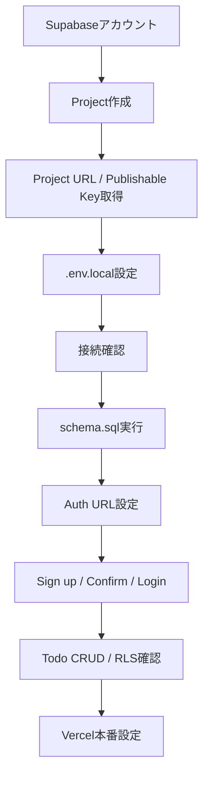
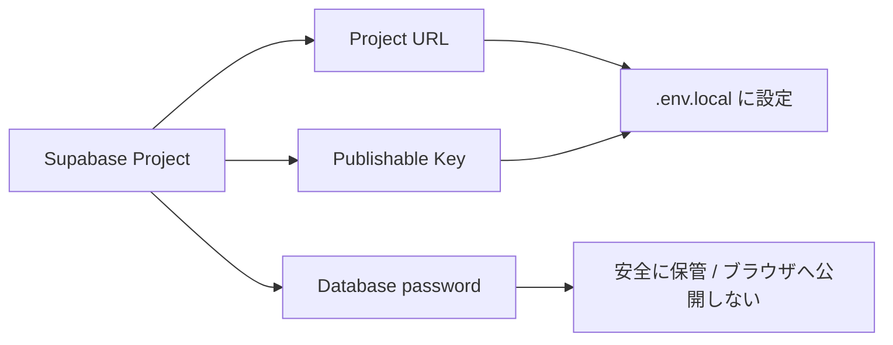
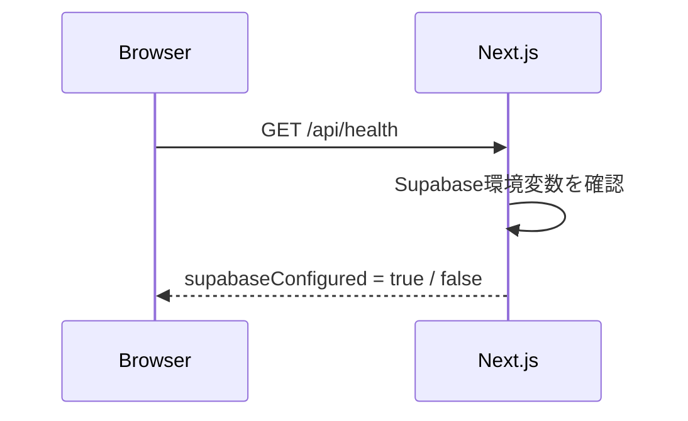
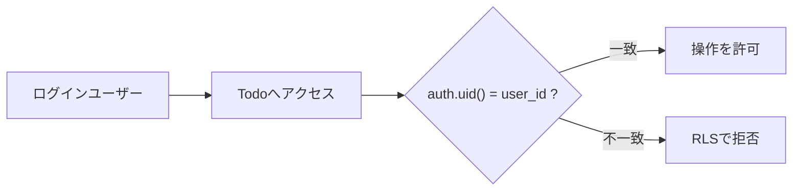
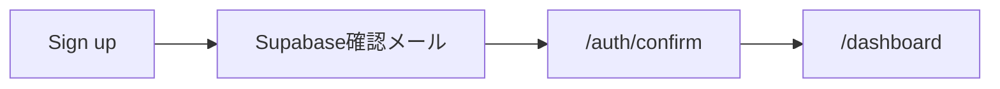
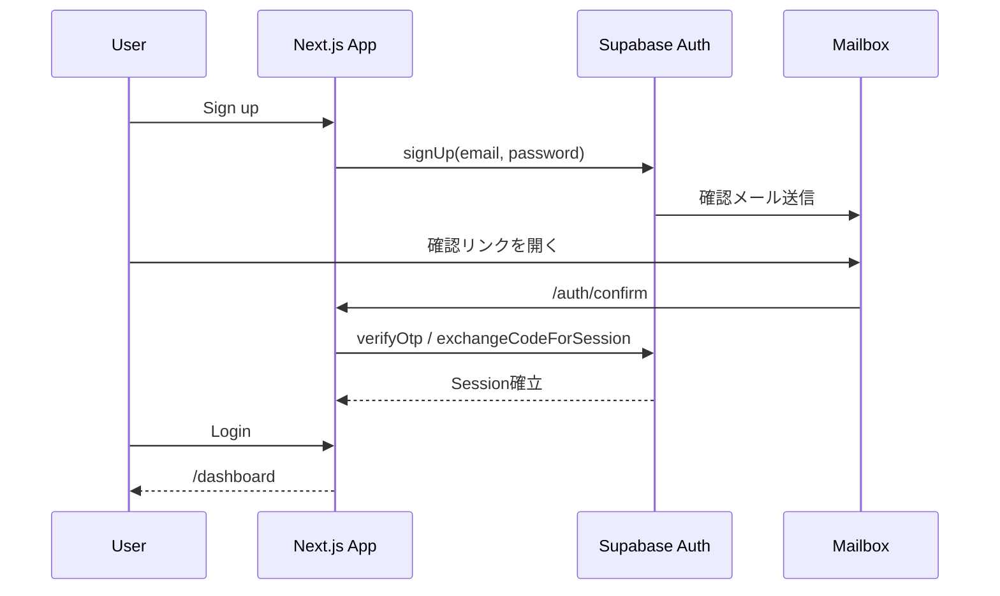
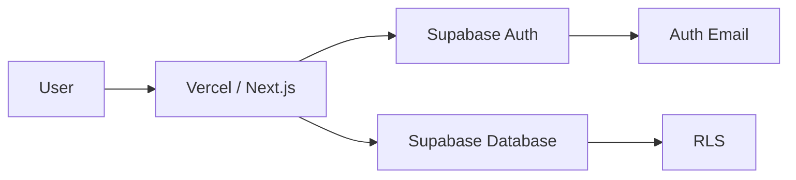
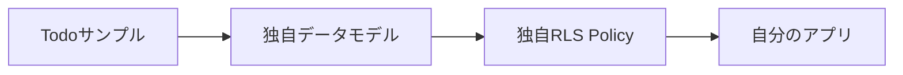

# Supabase セットアップ手順

このドキュメントは、このテンプレートをCloneした利用者が、**新しいSupabaseプロジェクトを作成し、認証・Database・RLS・Todoサンプルを動かすまで**を順番に実施するための手順です。

このテンプレートでSupabaseを利用するために必要なものは、基本的に次の3つです。

1. Supabase Project
2. Project URL + Publishable Key
3. Auth / Database / RLS の設定

`todos` はCRUD/RLSを確認するための削除可能なサンプルです。独自アプリでは、動作確認後に自分のテーブルとRLSへ置き換えてください。

## セットアップ全体像



---

## 1. Supabaseアカウントを準備する

Supabaseへサインインし、Dashboardを開きます。

- Supabase: https://supabase.com/
- Project作成: https://database.new/

GitHubアカウントなどでサインインできます。

Organizationがまだ無い場合は、Dashboardの案内に従って作成します。

## 2. 新しいProjectを作成する

Supabase Dashboardから新しいProjectを作成します。

入力する主な項目:

- **Project name**: 作成するアプリが分かる名前
- **Database password**: 十分に強いパスワード
- **Region**: 主な利用者に近いリージョン
- **Plan**: 開発・検証・本番の要件に合うプラン

Database passwordはDB管理用の重要な秘密情報です。

**このテンプレートの `.env.local` には設定しません。GitHubにもコミットしないでください。** パスワードマネージャーなどで安全に保管します。



Project作成後、Databaseなどの準備が完了するまで待ちます。

## 3. Project URLとPublishable Keyを取得する

Projectを開き、Dashboardの **Connect** からAPI接続情報を確認します。

このテンプレートで使うのは次の2つです。

- **Project URL**
- **Publishable key**

例:

```text
Project URL:
https://xxxxxxxxxxxxxxxxxxxx.supabase.co

Publishable key:
sb_publishable_xxxxxxxxxxxxxxxxxxxx
```

### 使用しない秘密情報

ブラウザへ公開してはいけない秘密情報を `NEXT_PUBLIC_` へ設定しないでください。

特に以下は、このテンプレートのブラウザ用接続には使用しません。

- Secret Key
- `service_role` key
- Database password

このテンプレートは `NEXT_PUBLIC_SUPABASE_PUBLISHABLE_KEY` を使用します。

## 4. `.env.local` を作成する

リポジトリのルートで `.env.example` をコピーします。

Windows PowerShell:

```powershell
Copy-Item .env.example .env.local
```

macOS / Linux:

```bash
cp .env.example .env.local
```

`.env.local` を次のように設定します。

```env
NEXT_PUBLIC_SUPABASE_URL=https://xxxxxxxxxxxxxxxxxxxx.supabase.co
NEXT_PUBLIC_SUPABASE_PUBLISHABLE_KEY=sb_publishable_xxxxxxxxxxxxxxxxxxxx
```

ローカル開発だけなら、まずはこの2項目で構いません。

本番URLが確定したら、Production環境では次も設定します。

```env
NEXT_PUBLIC_SITE_URL=https://your-app.example.com
```

`.env.local` は `.gitignore` 対象です。**GitHubへコミットしないでください。**

## 5. Supabase接続を確認する

開発サーバーを起動します。

```powershell
npm run dev
```

ブラウザで次を開きます。

```text
http://localhost:3000/api/health
```



Supabase環境変数が正しく読み込まれていれば、レスポンスの `supabaseConfigured` が `true` になります。

`false` の場合は、次を確認します。

- `.env.local` がリポジトリ直下にあるか
- 変数名に誤字がないか
- URL / Publishable Keyの前後に不要な空白がないか
- `.env.local` 変更後に開発サーバーを再起動したか

## 6. Todoサンプル用Databaseを作成する

Auth / CRUD / RLSの動作例を確認する場合は、Supabase Dashboardで **SQL Editor** を開きます。

リポジトリ内の次のファイルを開きます。

```text
supabase/schema.sql
```

ファイル全体をSQL Editorへ貼り付けて **Run** します。

このSQLは次を行います。

- `public.todos` テーブル作成
- `user_id` と `auth.users` の関連付け
- RLS有効化
- `anon` の権限削除
- `authenticated` へ必要なCRUD権限を付与
- SELECT / INSERT / UPDATE / DELETE の所有者RLS Policy作成

所有者判定は次の考え方です。

```sql
auth.uid() = user_id
```

つまり、ログインユーザーは**自分自身のTodoだけ**を読み書きできます。



### SQL実行後の確認

Supabase DashboardのTable Editorなどから `todos` が作成されたことを確認します。

RLSを無効化して動作確認することは避けてください。このテンプレートでは、RLSが有効な状態を前提に動作確認します。

> `schema.sql` はTodoサンプル用です。独自アプリでは、自分のデータモデルとアクセス要件に合わせてテーブル・GRANT・RLS Policyを設計し直してください。

## 7. Email / Password認証を確認する

Supabase hosted projectではEmail認証は標準で利用できます。メール確認も通常は有効です。

Dashboardで **Authentication → Providers** を開き、Email providerを確認します。

テンプレートの標準動作では次を想定しています。

- Email provider: 有効
- 新規Sign up: 有効
- Confirm Email: 有効

開発中にメール確認を無効にすることもできますが、本番用途ではメール確認を有効にすることを推奨します。

## 8. AuthのSite URL / Redirect URLを設定する

Dashboardで **Authentication → URL Configuration** を開きます。

ローカル開発では次を設定します。

```text
Site URL
http://localhost:3000
```

Additional Redirect URLsへ次を追加します。

```text
http://localhost:3000/**
```

このテンプレートのSign upは、確認後の戻り先として `/auth/confirm` を使用します。



### 本番公開後

Vercelなどへ公開したら、Site URLを**本番URL**へ変更します。

例:

```text
https://my-app.vercel.app
```

Additional Redirect URLsにも本番URLを追加します。

```text
https://my-app.vercel.app/**
```

本番環境では、可能な限り正確なURLを許可し、不必要に広いワイルドカードを設定しないでください。

### Vercel PreviewでもAuth確認する場合

Preview URLで認証を試す場合は、SupabaseのRedirect URLにもVercel Preview用URLを許可する必要があります。

Supabase公式では、Vercel Preview向けに次の形式が案内されています。

```text
https://*-<team-or-account-slug>.vercel.app/**
```

PreviewでAuthを確認しない場合は追加不要です。

## 9. 確認メールテンプレート

まずはSupabase標準の確認メールで動作確認できます。

このテンプレートの `/auth/confirm` は次の両方を処理できるようにしています。

- PKCE `code`
- `token_hash` + `type`

SSR向けに確認メールをカスタマイズする場合は、SupabaseのEmail TemplatesでToken Hashを使う方式を利用できます。

Dashboard:

```text
Authentication → Email Templates → Confirm signup
```

メールテンプレートを変更する場合は、Supabase公式のSSR / Email Template手順を確認し、`/auth/confirm` へ戻るURLを維持してください。

テンプレート変更は初回セットアップの必須作業ではありません。

## 10. Sign up → Login → CRUDを確認する

開発サーバーを起動した状態で、次の順に確認します。



### 10.1 Sign up

```text
http://localhost:3000/auth/sign-up
```

1. メールアドレスを入力
2. 8文字以上のパスワードを入力
3. Sign up
4. 確認メールを受信
5. メール内の確認リンクを開く

Supabase Dashboardの **Authentication → Users** でもユーザー作成を確認できます。

### 10.2 Login

```text
http://localhost:3000/auth/login
```

確認済みのメールアドレスとパスワードでログインします。

### 10.3 Todo CRUD

ログイン後:

```text
http://localhost:3000/dashboard
```

次を確認します。

- Todo追加
- Todo完了/未完了切替
- Todo削除
- Sign out

別ユーザーを作成した場合、それぞれが自分のTodoだけを表示・更新できればRLSも期待どおりに動いています。

## 11. 確認メールが届かない場合

まずSupabase DashboardのAuth Logsなどで送信結果を確認します。

Supabaseの標準メール送信機能は**開発・試用向け**で、送信制限があります。Custom SMTP未設定時は送信先にも制限があるため、任意の実ユーザーへメールを送る本番用途には向きません。

実ユーザー向けに本番運用する場合は、**Custom SMTPを設定してください。**

本番公開前には次も確認します。

- 独自SMTPから確認メールが届く
- Fromアドレス / ドメインが適切
- Confirm signupが正常に完了する
- Password resetメールも正常に届く

## 12. Vercelへ環境変数を設定する

Vercelへデプロイする場合、ProjectのEnvironment Variablesへ次を設定します。

必須:

```text
NEXT_PUBLIC_SUPABASE_URL
NEXT_PUBLIC_SUPABASE_PUBLISHABLE_KEY
```

Productionでは追加:

```text
NEXT_PUBLIC_SITE_URL
```

値の例:

```text
NEXT_PUBLIC_SITE_URL=https://my-app.vercel.app
```

おすすめの設定範囲:

- `NEXT_PUBLIC_SUPABASE_URL`: Production / Preview / Development
- `NEXT_PUBLIC_SUPABASE_PUBLISHABLE_KEY`: Production / Preview / Development
- `NEXT_PUBLIC_SITE_URL`: Productionの本番URL

Preview環境では `NEXT_PUBLIC_SITE_URL` を本番URLへ固定しない運用も可能です。このテンプレートは未設定時にリクエストのOriginを利用します。

環境変数を追加・変更した場合は、Vercelで再デプロイします。

### 本番構成



## 13. 本番公開時のSupabase URL設定

VercelのProduction URLが決まったら、Supabase Dashboardへ戻り、Authentication → URL Configurationを更新します。

例:

```text
Site URL:
https://my-app.vercel.app

Additional Redirect URL:
https://my-app.vercel.app/**
```

ローカル開発も継続する場合は、次も残します。

```text
http://localhost:3000/**
```

## 14. 最終確認チェックリスト

- [ ] Supabase Projectを作成した
- [ ] Database passwordを安全に保管した
- [ ] Project URLを取得した
- [ ] Publishable Keyを取得した
- [ ] `.env.local` を作成した
- [ ] `/api/health` の `supabaseConfigured` が `true`
- [ ] `supabase/schema.sql` を実行した（Todoサンプルを利用する場合）
- [ ] `todos` のRLSが有効
- [ ] Email provider / Confirm Emailを確認した
- [ ] Site URLを設定した
- [ ] localhost Redirect URLを追加した
- [ ] Sign upできる
- [ ] 確認メールから認証できる
- [ ] Loginできる
- [ ] Todo CRUDが動く
- [ ] 別ユーザーのTodoが見えない
- [ ] 本番ではCustom SMTPを検討・設定した
- [ ] VercelへSupabase環境変数を設定した
- [ ] Production URLをSupabaseへ登録した
- [ ] `npm run check` が成功する

## 15. よくある問題

### `Supabase の環境変数を設定してください` と表示される

`.env.local` のURL / Publishable Keyと、開発サーバー再起動を確認します。

### Sign up後に確認リンクでlocalhostへ戻らない

Authentication → URL Configurationで次を確認します。

```text
Site URL: http://localhost:3000
Redirect URL: http://localhost:3000/**
```

### 本番の確認メールからlocalhostへ戻ってしまう

Site URLをVercelのProduction URLへ変更し、本番URLをRedirect URLへ追加します。

### `permission denied` / `42501` が出る

RLS Policyだけでなく、PostgresのGRANTも必要です。Todoサンプルでは `supabase/schema.sql` が `authenticated` へ必要なCRUD権限を付与します。

### LoginできるがTodoが見えない

次を確認します。

- `supabase/schema.sql` を実行済みか
- RLSが有効か
- Policyが作成されているか
- ログイン中ユーザーの `auth.uid()` と `todos.user_id` が一致しているか

### メールが届かない

- Authentication設定を確認
- Auth Logsを確認
- 迷惑メールフォルダを確認
- Supabase標準メールの送信制限を確認
- 本番ではCustom SMTPを設定

## 16. 独自アプリへ移行する場合

Todoサンプルの動作確認が終わったら、[CUSTOMIZING.md](CUSTOMIZING.md) に沿って独自アプリへ置き換えます。

特にDatabaseでは、Todo用RLSをコピーして終わりにせず、**そのアプリのデータ所有・共有・管理者権限を整理してからPolicyを設計してください。**



## 公式ドキュメント

- Next.js Auth Quickstart: https://supabase.com/docs/guides/auth/quickstarts/nextjs
- Next.js Quickstart: https://supabase.com/docs/guides/getting-started/quickstarts/nextjs
- Redirect URLs: https://supabase.com/docs/guides/auth/redirect-urls
- Password-based Auth: https://supabase.com/docs/guides/auth/passwords
- Email Templates: https://supabase.com/docs/guides/auth/auth-email-templates
- Custom SMTP: https://supabase.com/docs/guides/auth/auth-smtp
- Row Level Security: https://supabase.com/docs/guides/database/postgres/row-level-security
