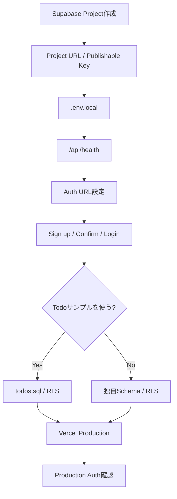
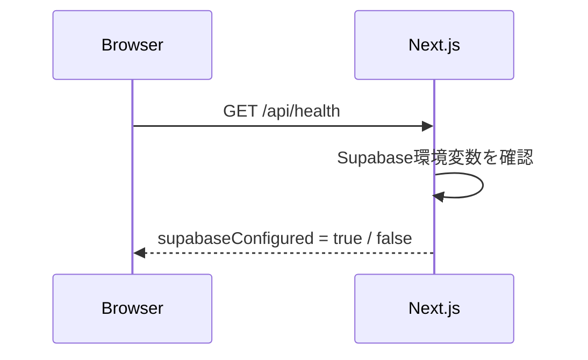
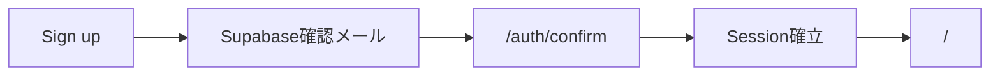
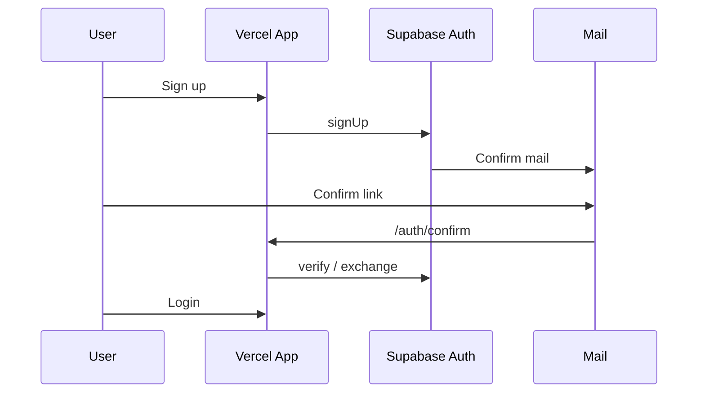

# Supabase セットアップ手順

このドキュメントは、このテンプレートから新しいWebアプリを作る利用者が、**Supabase Project作成 → 接続 → Auth設定 → 必要ならTodo CRUD / RLSサンプル確認 → Vercel本番設定**まで順番に進めるための手順です。

Todo CRUDは削除可能なサンプルです。Supabase接続やAuthだけを使う場合、Todo用SQLを実行する必要はありません。

第三者として実際にテンプレートを利用した結果から得た注意点は [THIRD-PARTY-VALIDATION.md](THIRD-PARTY-VALIDATION.md) にまとめています。

## セットアップ全体像



## 1. Supabase Projectを作成する

Supabase Dashboardで新しいProjectを作成します。

主な項目:

- **Project name**: アプリが分かる名前
- **Database password**: 強いパスワード
- **Region**: 主な利用者に近いリージョン
- **Plan**: 開発・本番要件に合うプラン

Database passwordは秘密情報です。`.env.local` やGitHubへ保存しません。

## 2. Project URLとPublishable Keyを取得する

Projectを開き、Dashboardの **Connect** から次を取得します。

- **Project URL**
- **Publishable Key**

例:

```text
Project URL:
https://xxxxxxxxxxxxxxxxxxxx.supabase.co

Publishable Key:
sb_publishable_xxxxxxxxxxxxxxxxxxxx
```

次は `NEXT_PUBLIC_` へ設定しません。

- Secret Key
- `service_role` key
- Database password

このテンプレートはブラウザへ公開可能な `NEXT_PUBLIC_SUPABASE_PUBLISHABLE_KEY` を使用します。

## 3. `.env.local` を作成する

Windows PowerShell:

```powershell
Copy-Item .env.example .env.local
```

macOS / Linux:

```bash
cp .env.example .env.local
```

`.env.local`:

```env
NEXT_PUBLIC_SUPABASE_URL=https://xxxxxxxxxxxxxxxxxxxx.supabase.co
NEXT_PUBLIC_SUPABASE_PUBLISHABLE_KEY=sb_publishable_xxxxxxxxxxxxxxxxxxxx
```

ローカル開発ではまずこの2項目で構いません。

Production URLが確定したら、VercelのProduction環境には次も設定します。

```env
NEXT_PUBLIC_SITE_URL=https://your-app.vercel.app
```

`.env.local` は `.gitignore` 対象です。GitHubへコミットしません。

## 4. Supabase接続を確認する

```powershell
npm run dev
```

ブラウザで次を開きます。

```text
http://localhost:3000/api/health
```



`supabaseConfigured` が `true` なら環境変数が読み込まれています。

`false` の場合は次を確認します。

- `.env.local` がRepository直下にある
- 変数名に誤字がない
- URL / Publishable Key前後に空白がない
- `.env.local` 変更後に開発サーバーを再起動した

## 5. Email / Password認証を確認する

Dashboardで **Authentication → Providers** を開き、Email providerを確認します。

テンプレートの標準想定:

- Email provider: 有効
- 新規Sign up: 有効
- Confirm Email: 有効

本番用途ではメール確認を有効にすることを推奨します。

## 6. Authentication → URL Configurationを設定する

Dashboardで **Authentication → URL Configuration** を開きます。

### ローカル開発

```text
Site URL:
http://localhost:3000

Additional Redirect URL:
http://localhost:3000/**
```

ローカルは複数パスを使うためwildcardで構いません。

### Vercel Production

Production URLが確定したらSite URLを本番URLへ変更します。

```text
Site URL:
https://your-app.vercel.app
```

このテンプレートのSign up確認後の戻り先は固定です。

```text
https://your-app.vercel.app/auth/confirm
```

ProductionのAdditional Redirect URLにはこの**必要な固定パス**を登録します。

```text
Additional Redirect URL:
https://your-app.vercel.app/auth/confirm
```

本番では不必要に `/**` を許可しません。

Preview DeployでもAuthを試す場合だけ、Vercel Preview用wildcardを追加してください。



## 7. 確認メールを確認する

まずはSupabase標準の確認メールで動作確認できます。

このテンプレートの `/auth/confirm` は次を処理できます。

- PKCE `code`
- `token_hash` + `type`

SSR向けにメールTemplateをカスタマイズする場合は、SupabaseのEmail TemplatesでToken Hash方式を利用できます。

```text
Authentication → Email Templates → Confirm signup
```

本番で実ユーザーへ安定してメールを送る場合は **Custom SMTP** を設定し、次も確認します。

- Fromアドレス / ドメイン
- Confirm signup
- Password reset
- Authentication Logs

## 8. Sign up → Confirm → Loginを確認する

```text
http://localhost:3000/auth/sign-up
```

1. メールアドレスを入力
2. 8文字以上のパスワードを入力
3. Sign up
4. 確認メールを受信
5. 確認リンクを開く
6. Supabase Dashboardの **Authentication → Users** でも作成を確認

続いて:

```text
http://localhost:3000/auth/login
```

確認済みユーザーでLoginします。

## 9. Todoサンプル用Databaseを作成する（任意）

Todo CRUD / RLSサンプルを試す場合だけ実施します。

Supabase SQL Editorで次を実行します。

```text
supabase/sample/todos.sql
```

このSQLは次を行います。

- `public.todos` を作成
- `user_id → auth.users(id)` のFKを設定
- `user_id` indexを作成
- RLSを有効化
- `anon` のテーブル権限を全削除
- `authenticated` の既定テーブル権限も一度全削除
- `authenticated` へ SELECT / INSERT / UPDATE / DELETE だけを付与
- 所有者RLS Policyを作成

所有者判定:

```sql
auth.uid() = user_id
```

### なぜauthenticatedもrevokeするのか

実地テストでは、CRUDだけをgrantしてもSupabase Projectの既定権限として `REFERENCES`、`TRIGGER`、`TRUNCATE` が残るケースを確認しました。

そのため、このサンプルでは次の順番を明示します。

```sql
revoke all on table public.todos from anon;
revoke all on table public.todos from authenticated;
grant select, insert, update, delete on table public.todos to authenticated;
```

RLSとGRANTは別レイヤーなので、両方を確認します。

### なぜuser_idへindexを付けるのか

所有者RLSやユーザー単位の一覧取得では `user_id` を頻繁に使います。

実地テストでは、FKにindexが無い状態をSupabase Performance Advisorが `unindexed_foreign_keys` として検出しました。

## 10. Todo CRUD / RLSを確認する（任意）

ログイン後:

```text
http://localhost:3000/dashboard
```

確認内容:

- Todo追加
- Todo完了 / 未完了切替
- Todo削除
- Sign out

さらにユーザーを2人作り、ユーザーAのTodoがユーザーBから見えないことを確認します。

Todoサンプルは次の4か所に分離されています。

```text
app/(sample)/dashboard/
features/todos/
supabase/sample/todos.sql
tests/sample.test.mjs
```

独自アプリでは4か所をまとめて削除できます。

## 11. Supabase Advisorを確認する

Schema / RLS / GRANT / Indexを変更した後は、Supabaseの次を確認します。

- Security Advisor
- Performance Advisor

RLS不足などSecurity Advisorの指摘を残したまま本番へ進めません。

新しく作成したindexは、まだクエリ実績が無い間 `unused_index` INFOになる場合があります。新規Project直後は異常ではありません。

## 12. Vercelへ環境変数を設定する

Vercel ProjectのEnvironment Variablesへ設定します。

必須:

```text
NEXT_PUBLIC_SUPABASE_URL
NEXT_PUBLIC_SUPABASE_PUBLISHABLE_KEY
```

Productionでは追加:

```text
NEXT_PUBLIC_SITE_URL=https://your-app.vercel.app
```

環境変数を追加・変更した後は再Deployします。

## 13. Productionで確認する

Production URLで次を確認します。

```text
/
/api/health
/auth/sign-up
/auth/login
/dashboard または独自の認証必須Route
```

`/api/health` でSupabase設定が有効になっていることを確認します。

Authは次を実際に1回通します。



## 14. よくある問題

### `supabaseConfigured: false`

- Vercel / `.env.local` の変数名
- Project URL / Publishable Key
- 再Deploy / dev server再起動

### 確認後にlocalhostへ戻る

- `NEXT_PUBLIC_SITE_URL` がProductionに設定されているか
- SupabaseのSite URLがProduction URLか
- Additional Redirect URLに `/auth/confirm` が登録されているか

### Todoが表示できない

- `supabase/sample/todos.sql` を実行したか
- `public.todos` が存在するか
- RLSが有効か
- `authenticated` にCRUDだけがgrantされているか
- Sessionが有効か

### 別ユーザーのデータが見える

RLS設計の問題です。本番利用を止め、Policyと所有者列を確認します。画面側で隠すだけでは対策になりません。

## 完了確認

共通基盤:

- Project URLとPublishable Keyを設定した
- `/api/health` で接続設定を確認した
- Authentication → URL Configurationを設定した
- Productionで `NEXT_PUBLIC_SITE_URL` を設定した
- Sign up / Confirm / Loginを確認した
- SecretをGitHubへ保存していない

Databaseを使う場合:

- RLSを有効化した
- `anon` / `authenticated` のテーブル権限を最小化した
- 所有者列へ必要なindexを作成した
- 2ユーザーで所有者分離を確認した
- Security / Performance Advisorを確認した

最後に:

```powershell
npm run check
```

が成功することを確認します。
