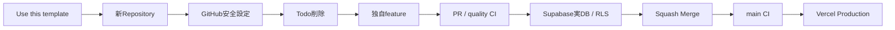

# 第三者実地テストで確認したこと

このドキュメントは、テンプレートを **Use this template から別Repositoryとして作成し、Todoサンプルを削除して独自機能へ置き換え、Supabase / Vercelまで実際に接続した結果**を、今後の利用者向けチェックポイントとして残すものです。

机上の手順確認ではなく、実Repository・実Supabase Project・実Vercel Deployで確認した内容です。

## 実地テストの流れ



## 1. Use this template後に引き継がれないもの

Repositoryのファイルは複製されますが、GitHub Rulesetは新Repositoryへ自動継承されません。

新RepositoryをCloneしたら、カスタマイズを始める前に次を実行します。

```powershell
.\scripts\setup-github.ps1 -Repository owner/new-repository
```

`Protect main` がActiveになり、`quality` Required Check、PR必須、Conversation resolution、Linear history、Squash Merge onlyなどが入ったことを確認します。

ChatGPTのGitHub連携を **Only select repositories** にしている場合、新Repositoryも連携対象へ追加する必要があります。

## 2. Supabaseのテーブル権限は「grantだけ」では不足する場合がある

実地テストでは、新規テーブルに対してCRUDだけをgrantしても、Supabase側の既定権限として `REFERENCES`、`TRIGGER`、`TRUNCATE` などが `authenticated` に残るケースを確認しました。

そのため、ブラウザから使うテーブルは最小権限を明示します。

```sql
revoke all on table public.example from anon;
revoke all on table public.example from authenticated;
grant select, insert, update, delete on table public.example to authenticated;
```

RLSが有効でも、テーブル権限は別レイヤーです。**RLSとGRANTの両方を確認**します。

確認例:

```sql
select grantee, privilege_type
from information_schema.role_table_grants
where table_schema = 'public'
  and table_name = 'example'
  and grantee in ('anon', 'authenticated')
order by grantee, privilege_type;
```

## 3. 所有者列には索引を付ける

`user_id` を使って所有者RLSやユーザー単位の一覧取得を行う場合、FKだけでなく索引も作成します。

```sql
create index if not exists example_user_id_idx
on public.example (user_id);
```

実地テストでは、索引なしの状態をSupabase Performance Advisorが `unindexed_foreign_keys` として検出しました。

作成直後の索引は、まだアクセス実績が無いため `unused_index` INFOになることがあります。これは新規Project直後には正常です。

## 4. RLSはPolicyの文字列だけでなく2ユーザーで確認する

少なくとも次を確認します。

- ユーザーAはAのデータを読める
- ユーザーBはAのデータを読めない
- BはBのデータを作成できる
- AはBのデータを更新できない
- AはBのデータを削除できない

テストデータをDBへ直接作る場合はTransaction内で実施し、最後にRollbackすれば検証用データを残さず確認できます。

## 5. Supabase AdvisorをDDL後に確認する

Schema / RLS / GRANT / Indexを変更したら、Supabase Dashboardまたは利用可能な管理ツールで次を確認します。

- Security Advisor
- Performance Advisor

Security AdvisorのRLS関連指摘を放置したまま本番へ進めません。

## 6. Production Authは本番URLを明示する

Vercel Production URLが確定したら、Vercelへ次を設定します。

```text
NEXT_PUBLIC_SITE_URL=https://your-app.vercel.app
```

Supabase Dashboardの **Authentication → URL Configuration** では、ProductionのSite URLを本番URLへ変更します。

このテンプレートの確認メールの戻り先は固定パスです。

```text
https://your-app.vercel.app/auth/confirm
```

ProductionではAdditional Redirect URLをこのパスへ限定します。Preview DeployでAuthも試す場合だけ、Preview用wildcardを追加します。

Supabase公式ドキュメントでも、本番では不必要に広いglobstarより正確なredirect pathが推奨されています。

## 7. VercelではDeploy成功だけで終わらせない

Production Deploy後は少なくとも次を確認します。

```text
/
/api/health
/auth/sign-up
/auth/login
独自featureの認証必須Route
```

`/api/health` ではSupabase環境変数が有効であることを確認します。

認証必須Routeは未ログイン時にログイン画面へ遷移し、ログイン後は自分のデータだけを扱えることを確認します。

## 8. Health checkをAuth Proxyに依存させない

実地テストでは、Vercel Productionの `/api/health` が500になる問題を確認しました。

Health Route本体は設定状態をJSONで返すだけでしたが、共通 `proxy.ts` のmatcherが `/api/health` も対象にしていたため、Supabase Authのセッション検証がHealth Routeより先に実行されていました。

ヘルスチェックは、認証セッション更新やAuth外部通信に依存せず、アプリ自身の設定状態を返せる必要があります。そのため、このテンプレートでは `/api/health` をAuth Proxy対象外にします。

```text
/api/health -> Auth Proxyを通さずHealth Routeへ
その他のAuth対象Route -> Supabase Auth Proxyでセッション更新
```

変更後、Productionの `/api/health` で次を実際に確認しました。

```json
{
  "status": "ok",
  "supabaseConfigured": true
}
```

Vercel Deployが成功していても、Production URLを実際に開くまではこの種の実行時不具合を検出できません。

## 9. READMEを書き換えても共通資料への導線を残す

第三者がテンプレートを独自アプリへ変更すると、READMEもアプリ向けに書き換えることになります。

その際も次の共通資料へのリンクは残します。

- Beginner Guide
- GitHub Setup
- Development
- Operations
- Extending
- Template Smoke Test

テンプレートの品質契約テストがこれらの導線を確認しているため、誤って消した場合はCIで検出できます。

## 完了条件

第三者利用テストは、単にBuildが成功しただけでは完了にしません。

```text
Use this template
→ GitHub安全設定
→ sample削除
→ 独自feature
→ PR quality CI
→ Supabase実DB / RLS / Advisor
→ Squash Merge
→ main CI
→ Vercel Production
→ Auth / 業務Route確認
```

ここまで通れば、テンプレートを別アプリへ安全に転用できることを実地で確認できたと判断します。
